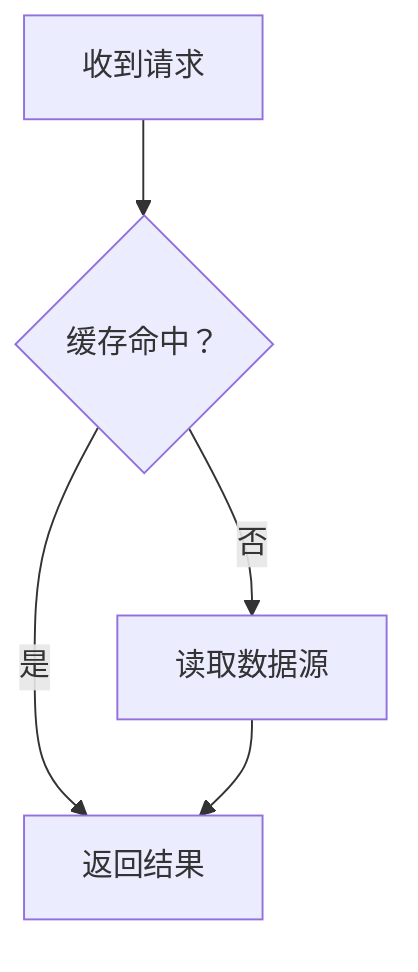

# Markdown 与文章呈现

按表达需要自由组合 Markdown 与扩展语法，包括脚注、引用、图表和数学公式。本文帮助选择表达形式、写清关系与出处，不是当前解析器的能力白名单；不因站点暂未解析某种语法而删减表达。用户会继续完善解析能力。

## 先看要表达的关系

| 解释需要 | 可用形式 |
|---|---|
| 连续展开判断或因果 | 段落及分层标题 |
| 执行步骤或确实并列的事项 | 有序或无序列表；任务清单用于状态记录 |
| 同一维度比较选项、条件或结果 | 表格 |
| 原话、前提或需要独立阅读的一段内容 | 引用块；外部原话另附来源 |
| 补充解释、适用条件或不宜打断主线的出处 | 脚注 |
| 操作依赖、条件分支或状态转换 | Mermaid 流程图或状态图 |
| 多方交接、消息顺序或并发时序 | Mermaid 序列图 |
| 真实界面、观察结果或结构示意 | 图片，提供说明与必要上下文 |
| 推导或数量关系 | 行内或块级公式 |
| 解释实现或让读者复现 | 带语言代码块，保留使用所需上下文 |

图前交代读者应观察什么，图后解释影响结论的关系。选择帮助读者理解的形式：一段简单文字就能说清的步骤无需画图，跨组件顺序容易误解时也不必强行用长段落解释。

不为“语法齐全”添内容，也不用字数、引用数或图表数判断文章质量。标题组织层次，段落展开解释；列表和表格承载确实并列或可比较的内容。

## 文章、论文与脚注

引用方式服从阅读需要：少量来源可直接在相关论点旁链接；补充说明可用脚注；需要集中比较多篇文章或论文时可列参考文献，并让正文引用能对应到具体条目。不要求每篇都有参考文献，也不设引用配额。

- **转述**：用自己的话准确概括，注明来源，不把原文的适用条件、实验设置或不确定性删掉。
- **原话**：用引号或引用块清楚标记，保留原意；需要时注明作者、文章或论文标题、章节或页码。翻译的引文注明是译文，省略或补充不得改变原意。
- **自己的推论**：说明从哪些事实推得、需要什么前提，不把自己的结论归到被引用作者名下。
- **出处核对**：实际读取所引用的材料，核对标题、作者、日期或版本以及它是否支持该论点。论文优先链接 DOI、出版方原文或作者公开稿；区分预印本与正式发表版本。技术实现可链接官方文档、源码固定提交或具体文件。
- **证据缺口**：只读到摘要就仅引用摘要支持的内容；通过二手材料获知的观点明确标注转引，不能写成读过原文。不得编造文献、作者、DOI、页码或看似可信的链接。

脚注用于补充信息，不把关键前提或影响结论的限制藏在脚注里。正常写法如下：

```markdown
这里比较的是发布顺序，而不是各阶段的耗时。[^scope]

[^scope]: 构建可以并行；进入生产切换前仍需确认目标版本及检查结果。
```

外部出处也可以放进脚注。参考文献条目按文章需要保留作者、标题、年份、版本和可靠链接；正文链接、脚注与参考文献可以组合使用。链接应指向实际支持论点的页面，而不是搜索结果页。引用块只负责排版，不能替代出处。

## 图表、图片与公式

Mermaid 用带 `mermaid` 语言的围栏：条件分支用 `flowchart`，状态及合法转换用 `stateDiagram-v2`，参与方交接与消息顺序用 `sequenceDiagram`。图中名称与正文术语一致，区分动作、状态和参与方；箭头方向及条件应准确表达材料中的关系。

下面只演示围栏和条件分支，不要求文章套用这张图：

````markdown

````

表格按相同维度比较，单元格保留必要条件与单位；长篇解释放在表格附近。图片用 ``，交代读者应观察什么；截图、实验图和外部图片按需要注明环境、来源与时间。示意图不能冒充实测结果。

行内公式用 `$...$`，独立推导用 `$$...$$`。在公式前后定义符号、单位和成立条件；正文解释等式为何成立，不靠堆公式代替论证。Markdown 源中的 LaTeX 命令正常使用反斜杠，传输时的字符串转义不应变成正文中的双写命令。

## 代码与输出

代码围栏标注语言；源码摘录保留解释所需上下文，完整示例说明输入、依赖和执行方式。按需要使用可运行代码扩展，但“准备供读者运行”与“已经实际运行”必须分清。附输出时注明对应环境和输入；未执行的内容标为预期结果或示意，不伪造运行记录。

图、公式、代码和引用都应帮助读者理解本文问题。展示形式可以自由组合，但它们不能替代事实核对，也不能把尚未验证的推论变成已证实结论。
