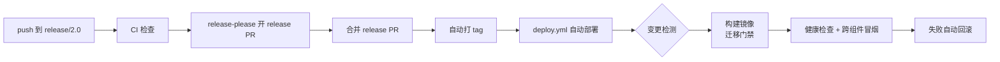

# 发布与回滚手册

## 线上拓扑

```text
https://xunrua.top
       │
       ▼
┌────────────────┐   /api/* /uploads/*   ┌──────────────┐
│  nginx-proxy   │ ────────────────────► │ blog-api:9090 │──► postgres / redis
│  (TLS + 反代)  │                        └──────────────┘
│                │   / (SSR)              ┌──────────────┐
│                │ ────────────────────► │ blog-web:3000 │
└────────────────┘   VIRTUAL_HOST        └──────────────┘
```

## 发版流程（release-please 自动化）

发版由 [release-please](https://github.com/googleapis/release-please) 自动化驱动,从 Conventional Commits 推导版本号并维护 CHANGELOG。



### 日常发版步骤

1. 正常开发,提交发版型 commit（`feat:` / `fix:` / `perf:` / `refactor:` 等）到 `release/2.0`。
   - 纯 `docs:` / `chore:` / `ci:` / `build:` / `test:` 改动不触发新版本（changelog-types 配置为 hidden）。
2. push 到 `release/2.0` 后,release-please 自动开一个「release PR」,标题形如 `chore(release): v2.0.2`,body 含从 commit log 生成的 CHANGELOG 段落。
3. review release PR 的 CHANGELOG 内容，并按「Release notes 改写规范」把新段落改写为功能聚合风格后**squash merge 合并该 PR**(release PR 固定用 squash 合并,合并 commit 即 `chore(release): vX.Y.Z` 单提交,release-please 据此识别不发新版本;功能/修复 PR 用 merge commit 保留原子提交,见 AGENTS.md「PR 与 issue 规范」)。
4. 合并即触发:release-please 自动打 `vX.Y.Z` tag → 触发 `Deploy` workflow。
5. `Deploy` 自动执行(13 job 流水线):verify-ci CI 门禁 → detect 按侧变更检测 → prepare 解析版本 → build-api / build-web 构建镜像 → prepare-server 服务器准备 → 迁移门禁 → 部署 api(含跨组件冒烟) → 部署 web → release(reload + 建 Release + 回写锚点) → github-release;失败时 rollback 按侧自动回滚,notify-failure 建告警 issue。
   - **单侧部署**:只部署实际变更侧(api/ 或 web/ 变更分别触发),未改动侧不重建容器;`docker-compose*.yml` 与 `scripts/**` 变更视为双侧。变更基线 = 各侧锚点(线上实际版本)。
6. 在 Actions 页或 `gh run list --workflow=deploy.yml` 观察结果;成功后各侧版本分别写入 `/root/docker/violet/.current-version-api` 与 `.current-version-web`。

### 部署失败的自愈与告警

- **notify-failure job**:任一 job 失败时创建/追加告警 issue(按 run id 去重)@维护者。跑在 GitHub 托管 runner 上——告警通道不能依赖被告警对象的网络(rua 访问 github.com 不稳定)。issue 未关闭期间兼作「tag 已发布但生产未部署」漂移状态的可见记录,重试成功或下次发版覆盖后人工确认关闭。
- **auto-retry workflow**(`.github/workflows/auto-retry.yml`):监听 Deploy 的 `workflow_run` failure 事件自动重试;`workflow_dispatch` 支持手动补救(错过事件时)。
- **workflow 生效语义**:tag push 触发的 Deploy 用 tag 指向 commit 的 workflow 版本(deploy.yml 修复要发版才生效);workflow_run / workflow_dispatch 类(auto-retry.yml)用默认分支版本(修复合并即生效)。
- 声明发布与执行发布分离:release-please 合并 release PR 的瞬间即打 tag + 建 GitHub Release,部署是 tag push 触发的异步后续。部署失败会出现「Release 页有版本但生产没部署」的漂移,靠告警 issue + auto-retry 接力 + 下次发版 detect 全量 diff 自动补偿,或 `gh workflow run auto-retry.yml -f run_id=<N>` 手动补救。

健康检查失败会自动回滚到各侧锚点记录的上一版本;若回滚后仍失败,工作流报错,需人工介入。

### 发版节奏说明

- violet 不做前后端独立版本(ADR-0003 明确不保留向后兼容),api 和 web 同 tag 发版,保证契约一致;但**部署按变更检测只部署实际变更侧**,未改动侧不重建容器。
- 纯非部署物变更(docs/CI/README 等)不发部署,仅创建 GitHub Release。

## Release notes 改写规范

release-please 的 CHANGELOG 粒度 = commit：功能/修复 PR 用 merge commit 合并时,分支上每个发版型 commit 都平铺进段落（v2.4.0 曾 25 条流水账上线,读者视角全是噪音）。因此 **release PR 合并前,先把新段落改写为功能聚合风格**（在 release PR 分支上 commit,squash 合并后段落即为最终态;Release body 由 release-please 从 CHANGELOG 段落生成,自动一致）。

改写原则:

- **读者视角**:写用户可感知的能力,不写 commit 流水账。
- **删中间态,保独立条目**:修本轮开发自引入问题的 commit、lint/CI/重构收尾等内部维护条目,一律不写入;每个用户可感知的能力独立成条,不为凑少而合并成顿号长句（scope 重复由网站 UI 聚合分组承担）。
- **删开发中间态**:修本轮开发自引入问题的 commit、lint/CI/重构收尾等内部维护条目,一律不写入。
- **保留 `**scope:**` 前缀与 `([#N](url))` issue 引用**:网站 /changelog 页依赖这两种格式渲染（scope 聚合分组、行尾引用小链接）;任务号 Tn/PRD 号等过程标注删去。
- **scope 中文化**:commit 的 scope 是英文模块名（diagram/deploy/web）,读者看不懂;改写为 release notes 时译成可读中文名——diagram→图块、web→网站、header→页头、theme→主题、toc→目录、deploy→部署、subscription→订阅、releases→发版、changelog→更新日志。commit message 本身不变,中文化只发生在 release notes 改写环节。
- **删 commit hash 引用**:`([abc1234](commit-url))` 读者不关心,改写时直接删（后端渲染时本也会剥离）。
- **保留版本标题行** `## [x.y.z](compare-url) (date)`:release-please 按此解析版本段。

已发布版本的补改:release-please 不会重写已发布段落,可直接在 `release/2.0` 上改 CHANGELOG.md 历史段落,并同步 `gh release edit <tag> --notes-file <file>` 更新 GitHub Release body（网站 changelog 数据源是 Releases API,Redis 缓存 ~1h 后自动刷新）。

## 单组件回滚

出问题时可单独回滚 api 或 web,不需要整体回滚。前提:目标历史 tag 的镜像仍在 rua 本地缓存(docker 不会主动清理)。

### 回滚 api（web 不动）

```bash
# Actions → Deploy → Run workflow
#   version = v2.0.1
#   skip_build = true
#   component = api
```

或命令行:
```bash
gh workflow run deploy.yml -f version=v2.0.1 -f skip_build=true -f component=api
```

### 回滚 web（api 不动）

```bash
gh workflow run deploy.yml -f version=v2.0.1 -f skip_build=true -f component=web
```

### 整体回滚（api + web 都回）

```bash
gh workflow run deploy.yml -f version=v2.0.1 -f skip_build=true -f component=both
```

回滚注意事项:

- 回滚假设 schema 向后兼容。若待回滚的新版本含破坏性迁移（删列、改类型）,回滚前需在 rua 手动 `make migrate-down` 或用 `go run ./cmd/migrate goto <v>`,并人工评审。
- **回滚成功后按侧回写锚点**为回滚目标版本(`.current-version-api` / `.current-version-web`)——保证下次发版的变更检测基线 = 线上实际版本,不泄漏未部署变更。
- **行为变更声明**:web-only 部署失败现在会自动回滚 web 侧(旧版 deploy.yml 的迁移门禁条件导致 web-only 失败不回滚),回滚后双侧健康检查。

## 手动重新部署当前版本

不改变版本,只重新构建并部署(如线上配置改动后需重启):

```bash
# Actions → Deploy → Run workflow（不填 version,留空 = 部署当前 HEAD）
# 或:
gh workflow run deploy.yml
```

## 迁移门禁失败处理

迁移 step 失败时 api 容器不会被替换,线上继续跑旧版本。常见原因:

- 迁移 SQL 语法错误:修迁移文件,发新 commit 让 release-please 重开 release PR。
- dirty 状态:在 rua 执行 `docker compose run --rm --no-deps --entrypoint /migrate api version` 查看,必要时 `docker compose run --rm --no-deps --entrypoint /migrate api force <v>` 修复。

## 紧急情况:CI 不可用时的手动兜底

self-hosted runner 离线又急需发版时,用手动流程(独立于 CI):

```bash
make deploy-remote
```

该流程使用 `docker-compose.prod.yml` 自行构建,详见 `manual-deploy.md`。

## 应急:release-please 故障时的手动发版

release-please 本身故障时,可用保留的应急脚本(日常禁用):

```bash
make release-patch    # 从最近 tag 自动 +1
```

注意:这会绕过 release-please 的 release PR review 关卡,仅在紧急情况使用。
