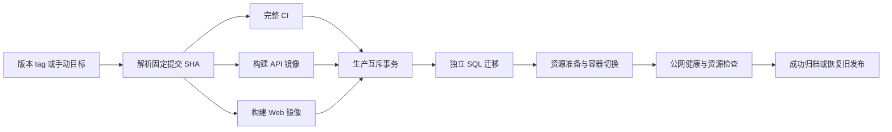

# 发布与回滚手册

## 日常发布

1. 功能与修复 PR 合入 `release/2.0`，release-please 根据 Conventional Commits 更新一个 release PR。普通 PR 用 merge commit，release PR 用 squash merge。
2. 合并 release PR 前检查版本与 CHANGELOG。release-please 创建 tag 和 GitHub Release，tag 触发 `Deploy`。
3. 在 Actions 的 Deploy summary 查看实际部署版本、提交、双侧镜像和 schema。GitHub Release 表示版本已发布，**不表示生产部署成功**。


```mermaid
flowchart LR
    A[版本 tag 或手动目标] --> P[解析固定提交 SHA]
    P --> C[完整 CI]
    P --> B[构建 API 镜像]
    P --> W[构建 Web 镜像]
    C --> D[生产互斥事务]
    B --> D
    W --> D
    D --> M[独立 SQL 迁移]
    M --> S[资源准备与容器切换]
    S --> H[公网健康与资源检查]
    H --> R[成功归档或恢复旧发布]
```

检查、API 构建和 Web 构建并行。只有生产事务使用 Actions concurrency，服务器另用文件锁防止 SSH 部署并发。Actions concurrency 不是 FIFO 队列，等待中的旧运行可能被新运行替换；进入生产锁后仍检查提交祖先关系，已被线上双侧版本包含的旧候选会跳过。

每次正常发布验证同一个提交的完整 CI，并构建双侧镜像；不再等待可能被新 push 取消的主干 CI，也不以空检查充当部署门禁。PR 的旧运行可取消，不同提交的主干运行互不取消。API、Web、依赖检查并行；基础设施检查失败会传递给既有 required check `Dependency Security`。

CI 包含 PostgreSQL 仓储与迁移集成测试、前端构建及 Playwright 契约测试，以及工作流、部署脚本和 Compose 校验。镜像用提交标签保存，实际部署只使用构建产出的 `ghcr.io/...@sha256:...`，不读取或改写 `latest`。

### 多个 PR 与补丁版本

默认不写 `Release-As`，由 release-please 对本批提交统一推导版本。用户明确要求锁定版本时，在发布批次确定后集中设置一次意图，避免多个并行分支各自把“下个 patch”写死。

PR 检查拒绝小于或等于目标分支 manifest 的版本意图；release-please 执行前再次检查最新主干整个未发布批次。若 release PR 先合并、旧 PR 后合并，过期 footer 会让发布流程明确失败，不能静默重用旧版本。修复时移除或更新尚未合并分支中的过期 footer；若已进入主干，需维护者处理该批次历史，普通追加一个新 footer 不会抵消旧 footer。

这不是合并队列。若分支规则允许使用旧的绿色检查，PR 仍可能合入，然后被发布前检查拦住。启用“合并前分支必须更新”可把失败提前到合并前。

## 生产事务与归档

公开入口由 `nginx-proxy` 提供 TLS，`/api/` 和 `/uploads/` 转发至 API，其余页面由 Web SSR 服务。带 hash 的静态资源由 nginx 的共享目录提供。PostgreSQL、Redis、上传和备份使用独立卷。

首次接入要求现有 API/Web 容器与 Compose 配置齐全、数据库迁移记录 clean。脚本先捕获实际镜像 ID 和配置，保存为 `bootstrap-*` 归档，再部署候选。它不是空服务器安装器。后续版本以 `/root/docker/violet/.releases/` 为准：

| 文件 | 运维用途 |
|---|---|
| `current.json` | 已验证的实际镜像组合、提交与数据库版本 |
| `versions/<版本>/` | 成功发布的清单、Compose 与 nginx 配置快照 |
| `schema.json` 与 `migrations/` | 当前 schema 及旧镜像恢复所需的迁移文件束 |
| `pending.json` 与 `transactions/` | 未完成事务与恢复依据 |

旧 `.current-version-api/web` 只用于首次导入，不再写入。归档版本绑定唯一镜像组合，不允许把同一个版本改成另一组镜像。默认部署 `both`；手动单侧发布会保留另一侧镜像及来源提交，但依然归档整套组合。**不能先用同一版本部署 API，再用它补部署 Web**；补齐时使用新提交或新版本。来源不明或交叉的单侧版本会被拒绝，改用更新的双侧发布。

切换前先拉取固定 digest、执行独立 `/migrate up`、准备静态资源。静态文件逐个原子替换，保留旧 hash 文件，避免打开中的页面丢失旧资源。切换后校验实际容器镜像、公网 API 健康、文章分页响应、SSR HTML 和同源 JS/CSS。

公网验收使用独立直连，不继承镜像拉取配置的 `HTTP_PROXY` / `HTTPS_PROXY`，HTTPS 证书仍按默认信任链校验。脚本不修改进程代理环境，镜像拉取继续使用原有代理。排查验收连接错误时检查服务器到站点的直连路径，不能仅以镜像代理可用判断站点可达。

生产 API 启动只检查 schema，不执行 SQL 迁移或 GORM AutoMigrate。迁移成功后发生资源准备、切换或健康检查失败，会恢复上一份双侧镜像与配置，并重新验证；此次部署仍报告失败。数据库不自动降级。旧 API 恢复时只读挂载与当前 schema 对应的迁移文件束，避免旧启动器因缺少新迁移文件无法启动；**这不保证旧业务代码兼容破坏性 schema 变化**，迁移必须保留回滚窗口内的读写兼容性。

## 回滚与手动部署

回滚仅接受服务器已归档的完整发布，恢复双侧镜像和配置；不构建、不拉远程镜像、不执行迁移。所需镜像必须仍在服务器缓存。

```bash
gh workflow run deploy.yml -f version=v2.0.1 -f skip_build=true -f component=both
```

将 `v2.0.1` 换成 `versions/` 下的实际归档名，也可指定首次捕获的 `bootstrap-*`。旧流程留下的 tag 不等于可回滚归档。不要为腾空间清理归档引用的镜像或迁移文件束。

正常手动发布已有 tag：

```bash
gh workflow run deploy.yml -f version=v2.0.2 -f component=both
```

不填 version 时部署所选 workflow ref 的提交，生成 `sha-<12位提交>` 标识；提交必须已合入 `release/2.0`。同版本重新构建若产生不同 digest 会被拒绝，应使用新提交发布。

Runner 不可用时通过 SSH 调用同一个事务入口，详见 [手动部署指南](manual-deploy.md)。不要用重打 `latest`、直接 `compose up` 或清空静态目录替代归档恢复。

## 失败处理

- **构建失败**：`auto-retry.yml` 仅重试 tag push 中单纯的 API/Web 构建失败，最多总计三次 attempt。CI、迁移、切换、健康检查或回滚失败均不自动重试生产操作。
- **部署已恢复旧版本**：查看失败日志与 summary，确认 `current.json` 的实际版本。修复问题后以新版本发布。
- **部署与恢复均失败**：错误摘要分别保留 `Deploy failed` 和 `restoration failed` 上下文；先区分首次失败与恢复失败的阶段，再检查 `pending.json`。摘要不输出子进程参数、标准输出或错误输出中的凭据；命令错误保留退出码或超时时间。
- **迁移失败或事务中断**：保留 `pending.json` 并阻止后续部署。先检查该记录的 phase、事务目录、当前容器镜像、`schema_migrations` 和公网状态。dirty 记录说明 SQL 可能部分执行；依据实际 schema 修复迁移，不能盲目 `force` 或删除 pending。
- **需要人工解除 pending**：先完成数据库一致性核对、恢复匹配的镜像与配置、验证公网，再将实际状态与 `current.json` 对齐并保留事故证据。只有确认不存在未完成写入时才能移除 pending；无法确认时保持阻断。

失败告警在托管 runner 上创建 Issue，按 run id 复用；同一 run 再次失败会重开已关闭告警。恢复成功后由维护者核对生产状态并关闭 Issue。告警不能替代运行结果与实际版本检查。

## GitHub 配置与上线边界

Go 检查与漏洞扫描获取最新 Go 1.26 补丁，避免 runner 缓存旧工具链。可修复的可达 Go 漏洞会阻断；`Fixed in: N/A` 仍作为告警，前端 `pnpm audit` 仍为 advisory。因此 CI 通过不代表依赖零漏洞，无修复版本的风险仍需单独跟踪。

工作流文件之外还需维护分支规则、tag 规则、production 环境与 runner 权限。此次代码改造不修改这些仓库设置：

- `release/2.0` 必须要求 Backend、Frontend、Dependency Security 通过；建议启用合并前更新分支，避免旧绿色检查绕过新基线。
- production 应限制允许部署的引用与执行者，并按团队需要设置审批；公开仓库的 self-hosted runner 不应用于不可信 PR 代码。
- 保护发布 tag，限制创建、修改与删除权限。Actions 固定完整 SHA，由 Dependabot 提供升级 PR。

合并工作流后，首个新 tag 才会使用这版 Deploy；旧 tag 重跑仍可能运行旧工作流。首次验证应使用包含本次改造的新版本，观察 bootstrap、schema 132、归档和公网检查结果。CI 本地测试通过不等于生产事务已演练。

## API 文档同步

`publish-apidocs.yml` 在成功的 tag push Deploy 后独立运行，也可手动触发。它读取生产 `/api/v1/openapi.json` 并推送 Apifox，失败不回滚部署。`workflow_run` 不使用分支过滤器排除 tag。实际文档以读取时的线上版本为准。

配置 `APIFOX_ACCESS_TOKEN`，账号须有目标项目管理员权限；未配置则跳过并告警。同步使用 `deleteUnmatchedResources=true`，手工增加但不在代码中的接口会被删除。

## Release notes 改写规范

release-please 的 CHANGELOG 粒度 = commit：功能/修复 PR 用 merge commit 合并时,分支上每个发版型 commit 都平铺进段落（v2.4.0 曾 25 条流水账上线,读者视角全是噪音）。因此 **release PR 合并前,先把新段落改写为功能聚合风格**（在 release PR 分支上 commit,squash 合并后段落即为最终态;Release body 由 release-please 从 CHANGELOG 段落生成,自动一致）。

改写原则:

- **读者视角**:写用户可感知的能力,不写 commit 流水账。
- **删中间态,保独立条目**:修本轮开发自引入问题的 commit、lint/CI/重构收尾等内部维护条目,一律不写入;每个用户可感知的能力独立成条,不为凑少而合并成顿号长句（scope 重复由网站 UI 聚合分组承担）。
- **保留 `**scope:**` 前缀与 `([#N](url))` issue 引用**:网站 /changelog 页依赖这两种格式渲染（scope 聚合分组、行尾引用小链接）;任务号 Tn/PRD 号等过程标注删去。
- **scope 中文化**:commit 的 scope 是英文模块名（diagram/deploy/web）,读者看不懂;改写为 release notes 时译成可读中文名——diagram→图块、web→网站、header→页头、theme→主题、toc→目录、deploy→部署、subscription→订阅、releases→发版、changelog→更新日志。commit message 本身不变,中文化只发生在 release notes 改写环节。
- **删 commit hash 引用**:`([abc1234](commit-url))` 读者不关心,改写时直接删（后端渲染时本也会剥离）。
- **保留版本标题行** `## [x.y.z](compare-url) (date)`:release-please 按此解析版本段。

已发布版本的补改:release-please 不会重写已发布段落,可直接在 `release/2.0` 上改 CHANGELOG.md 历史段落,并同步 `gh release edit <tag> --notes-file <file>` 更新 GitHub Release body（网站 changelog 数据源是 Releases API,Redis 缓存 ~1h 后自动刷新）。
