# 文章编辑器全功能特性手册

面向作者的完整功能参考。编辑器为 Tiptap 富文本（WYSIWYG），保存时双写：`content_html`（展示权威源，保留下划线/颜色/高亮/对齐等样式）与 `content_md`（Markdown 源，降级展示/导出用，有损——见第 11 节）。

**用法**：本文档本身就是一份「可直接粘贴的演示」。新建文章 → 全选复制本文档原文（含 `$`、`$$`、代码块、表格等）→ 粘贴保存 → 在前台逐项比对渲染效果。文档中的所有公式均为真实可渲染的 LaTeX，不是「源码↔预期」两列对照。

---

## 1. 文本样式

| 效果 | Markdown 语法 | 快捷键 | 备注 |
|---|---|---|---|
| 加粗 | `**文本**` | `Cmd/Ctrl+B` | |
| 斜体 | `*文本*` | `Cmd/Ctrl+I` | |
| 下划线 | 无 Markdown 表达 | `Cmd/Ctrl+U` | 仅存 content_html |
| 删除线 | `~~文本~~` | `Cmd/Ctrl+Shift+S` | |
| 行内代码 | `` `代码` `` | `Cmd/Ctrl+E` | |
| 高亮 | `==文本==` | 工具栏高亮按钮（多色） | 颜色仅存 content_html |
| 文字颜色 | 无 Markdown 表达 | **顶部工具栏色板** | 仅存 content_html |
| 链接 | `[文字](https://…)` | 工具栏/气泡菜单 | 裸 URL 自动识别为链接（autolink） |
| 对齐 | 无 Markdown 表达 | 工具栏（左/中/右/两端） | 作用于标题与段落 |

> 入口提示：颜色选择在**顶部工具栏色板**；气泡菜单（选中文本时浮出）只有「粗体 / 斜体 / 行内代码 / 链接」四项。

## 2. 标题与目录

支持 H1–H4 四级标题，语法为 `# ` / `## ` / `### ` / `#### ` 加空格。

- 文章页自动渲染**目录（TOC）**，提取 **H2 / H3 / H4**（H1 不进目录），锚点可点击跳转，滚动时高亮当前章节。
- 正文内 `#`+空格快捷生成标题；H1–H3 也可走 Slash 菜单。

## 3. 列表

无序（`-`/`*`/`+` 加空格）、有序（`1.` 加空格）、任务（`- [ ]` / `- [x]` 加空格）。

- 任务列表在文章页渲染为可读勾选框（只读）。
- 列表内 `Tab`/`Shift+Tab` 缩进/反缩进。

## 4. 引用与分割线

引用块用 `> ` 行首触发；分割线用 `---` 触发。

## 5. 代码块

```javascript
const a = 1;
```

- 行首输入 ` ``` ` 加语言名（如 `javascript`、`go`）再回车，或 Slash 菜单「代码块」插入。
- 编辑器右上角下拉切换语言；前台按语言高亮，并显示语言标签与复制按钮。

## 6. 图片

- 工具栏「图片」下拉 / Slash 菜单「图片」→ 本地上传或素材库。
- 上传走分片通道（`purpose=post`），支持秒传与断点续传。
- 文章页自动走 `w=1200` 缩略（GIF 保动画），点击看原图。
- Markdown 语法 `` 同样有效。

## 7. 表格

| 列 A | 列 B |
| --- | --- |
| 1 | 2 |

Slash 菜单或工具栏「表格」插入 3×3 空表（带表头）。光标进入表格后顶部出现表格工具栏：增删行列、合并/拆分单元格、删除整表。

---

## 8. 数学公式

渲染核心为 **KaTeX** + mhchem 扩展 + 项目物理宏表。本节每一条都是**可直接渲染的真实 LaTeX**——把本节整段贴入编辑器，应该看到对应的符号/公式排版，而不是命令名文本。

### 8.1 两种形态与输入规则

| 形态 | 渲染示例 | 输入方式 |
|---|---|---|
| 行内公式 | 质能方程 $E = mc^2$ 著名 | Slash「行内公式」，或粘贴 `$E=mc^2$` |
| 公式块 | 见下方示例 | Slash「公式块」，或粘贴 `$$...$$` |

> **键入提示**：手动键入时，编辑器的即时转换规则是 `$$...$$`（行内）与 `$$$...$$$`（块，行首三美元）；单 `$...$` 在键入时不会即时转换，但**粘贴或 Markdown 导入时**会被 `@tiptap/markdown` 正常识别为行内公式。手动插入最稳的方式是走 Slash 菜单。
>
> `$100`、`$5 美元` 这类货币写法不会误触公式。点击公式进入编辑态（源码 + 实时预览），`Esc`/`Enter` 退出。

### 8.2 基础结构（真实渲染）

- 上下标同挂：$x^{2}_{i}$、$a_{n}$、$x^2$
- 分数与展示型分数：$\frac{a}{b}$、$\dfrac{a}{b}$
- 根号与 n 次根：$\sqrt{x}$、$\sqrt[3]{x}$
- 分数作指数（嵌套）：$x^{\frac{1}{2}}$
- 二项式系数：$\binom{n}{k}$

### 8.3 希腊字母与常用符号

小写（含变体）：

$\alpha \, \beta \, \gamma \, \delta \, \epsilon \, \varepsilon \, \zeta \, \eta \, \theta \, \vartheta \, \iota \, \kappa \, \lambda \, \mu \, \nu \, \xi \, \pi \, \varpi \, \rho \, \varrho \, \sigma \, \varsigma \, \tau \, \upsilon \, \phi \, \varphi \, \chi \, \psi \, \omega$

大写：

$\Gamma \, \Delta \, \Theta \, \Lambda \, \Xi \, \Pi \, \Sigma \, \Upsilon \, \Phi \, \Psi \, \Omega$

关系与集合：

$\infty \, \partial \, \nabla \, \pm \, \mp \, \times \, \div \, \cdot \, \leq \, \geq \, \neq \, \approx \, \equiv \, \sim \, \propto$

$\in \, \notin \, \subset \, \subseteq \, \supset \, \supseteq \, \cup \, \cap \, \emptyset \, \forall \, \exists \, \neg \, \land \, \lor \, \Rightarrow \, \Leftrightarrow \, \to \, \mapsto$

> $\epsilon$ 与 $\varepsilon$、$\phi$ 与 $\varphi$ 形状不同——粘贴本行可见两种字形对照。

### 8.4 大型运算符（上下限）

$$\sum_{i=1}^{n} i = \frac{n(n+1)}{2} \qquad \prod_{k=1}^{n} k = n! \qquad \lim_{x \to 0} \frac{\sin x}{x} = 1$$

$$\int_0^1 x^2 \,dx = \frac{1}{3} \qquad \oint_C \vec{F} \cdot d\vec{r} = 0 \qquad \bigcup_{i=1}^{\infty} A_i \qquad \bigcap_{i=1}^{\infty} B_i$$

> 行内公式里大运算符的上下限会压缩到侧边：$\sum_{i=1}^{n} i$、$\int_0^1 x\,dx$；块级则在正上下方。

### 8.5 函数名与对数三角

$$\sin^2 x + \cos^2 x = 1 \qquad \tan x = \frac{\sin x}{\cos x}$$

$$\log_2 n + \ln x + \lg 100 \qquad \exp(x) \cdot \max(a,b) \cdot \min(a,b) \qquad \operatorname{rank}(A) = 3$$

> 函数名为直立体（不斜），`\operatorname{}` 可定义任意直立函数名。

### 8.6 括号与定界符

- 圆 / 方 / 花 / 角 / 双竖括号（花括号须转义）：$(x)$、$[x]$、$\{x\}$、$\langle x \rangle$、$\|x\|$
- 括号随内容自动放大：$\left( \dfrac{a}{b} \right)$、$\left[ \dfrac{a}{b} \right]$
- 左大括号右空（`\right.` 不可见闭合）：$\left\{ x \mid x > 0 \right.$
- 物理宏自动缩放圆括号：$\qty(\dfrac{a}{b})$

### 8.7 标注、帽子与向量

$$\vec{v} + \overrightarrow{AB} + \vu{k} \qquad \hat{x} + \bar{x} + \dot{x} + \ddot{x} + \tilde{x}$$

$$\overline{AB} \qquad \underline{AB} \qquad \overbrace{a+b+c}^{\text{项数}} \qquad \underbrace{x+y+z}_{\text{合计}}$$

> `\vu` 为物理宏单位向量（自动带帽子）。

### 8.8 矩阵与分段函数（全族环境）

裸矩阵 / 圆括号 / 方括号：

$$\begin{matrix} a & b \\ c & d \end{matrix} \qquad \begin{pmatrix} a & b \\ c & d \end{pmatrix} \qquad \begin{bmatrix} a & b \\ c & d \end{bmatrix}$$

花括号 / 单竖线 / 双竖线：

$$\begin{Bmatrix} a & b \\ c & d \end{Bmatrix} \qquad \begin{vmatrix} a & b \\ c & d \end{vmatrix} \qquad \begin{Vmatrix} a & b \\ c & d \end{Vmatrix}$$

分段函数与方程组：

$$f(x) = \begin{cases} x^2 & x \geq 0 \\ -x & x < 0 \end{cases} \qquad \begin{cases} x + y = 3 \\ x - y = 1 \end{cases}$$

> 行分隔 `\\`、列分隔 `&`。矩阵行尾的 `\\` 是合法语法不是污染——清洗反斜杠双写时务必保留。

### 8.9 对齐与多行

$$\begin{aligned} \nabla \times \vec{B} &= \mu_0 \vec{J} + \mu_0 \varepsilon_0 \frac{\partial \vec{E}}{\partial t} \\ \nabla \times \vec{E} &= -\frac{\partial \vec{B}}{\partial t} \end{aligned}$$

$$\begin{gathered} a = b + c + d \\ = e + f + g \end{gathered}$$

> `aligned` 按 `&` 对齐（通常放等号前）；`gathered` 各行居中。

### 8.10 字体与文本

$$\mathbb{R} \supset \mathbb{Q} \supset \mathbb{Z} \qquad \mathbf{F} = m\mathbf{a} \qquad \mathrm{d}x \qquad \mathcal{L} = T - V$$

> `\text{}` 内可排中文与混合文字：$x \text{（其中 } x \geq 0 \text{）}$。

### 8.11 空格

| 语法 | 渲染 | 含义 |
|---|---|---|
| `a\,b` | $a\,b$ | 窄空格（thin） |
| `a\;b` | $a\;b$ | 中空格（medium） |
| `a\ b` | $a\ b$ | 标准空格 |
| `a\quad b` | $a\quad b$ | 宽空格 |
| `a\qquad b` | $a\qquad b$ | 更宽 |

### 8.12 化学（mhchem 全语法）

**分子式与离子**

- 水、葡萄糖、硫酸：$\ce{H2O}$、$\ce{C6H12O6}$、$\ce{H2SO4}$
- 离子电荷：$\ce{SO4^2-}$、$\ce{Na+}$、$\ce{Ca^2+}$
- 同位素：$\ce{^{14}C}$、$\ce{^{235}U}$、$\ce{^{2}H}$
- 配位化合物：$\ce{[Cu(NH3)4]^2+}$、$\ce{[Fe(CN)6]^4-}$

**反应方程式**

$$\ce{2H2 + O2 -> 2H2O}$$

$$\ce{N2 + 3H2 <=> 2NH3}$$

$$\ce{CaCO3 ->[\Delta] CaO + CO2 ^}$$

$$\ce{NaCl(aq) + AgNO3(aq) -> AgCl v + NaNO3(aq)}$$

$$\ce{CH4 + 2O2 -> CO2 + 2H2O}$$

> `->` 反应箭头、`<=>` 可逆箭头、`^` 气体符号、`v` 沉淀符号、`[\Delta]` 反应条件、`(g)/(l)/(aq)` 物态标注——分子式中字母均直立体，不斜。

**物理单位**

$\pu{9.8 m/s^2}$、$\pu{1.6e-19 C}$、$\pu{298 K}$、$\pu{6.022e23/mol}$、$\pu{3.0e8 m/s}$

> `\pu{}` 输出直立体单位、自动处理科学计数与下标。

### 8.13 物理宏表（项目内置，全清单）

```latex
\RR \ZZ \NN \QQ \CC   \dd{} \dv{}{} \pdv{}{}
\bra{} \ket{} \braket{}{} \expval{}
\abs{} \norm{} \vu{}   \grad \divg \curl \qty()
```

| 源码 | 渲染 | 含义 |
|---|---|---|
| `\RR \ZZ \NN \QQ \CC` | $\RR \, \ZZ \, \NN \, \QQ \, \CC$ | 实数 / 整数 / 自然数 / 有理数 / 复数集 |
| `\dd{x}` | $\dd{x}$ | 直立体微分 d |
| `\dv{f}{x}` | $\dv{f}{x}$ | 莱布尼茨导数（双参数） |
| `\pdv{f}{x}` | $\pdv{f}{x}$ | 偏导（双参数） |
| `\bra{\phi}` `\ket{\psi}` `\braket{\phi}{\psi}` | $\bra{\phi}$ $\ket{\psi}$ $\braket{\phi}{\psi}$ | 狄拉克左矢 / 右矢 / 内积 |
| `\expval{H}` | $\expval{H}$ | 期望值（角括号） |
| `\abs{x}` `\norm{v}` | $\abs{x}$ $\norm{v}$ | 绝对值 / 范数（自动缩放） |
| `\vu{i}` | $\vu{i}$ | 单位向量（带帽子） |
| `\grad` `\divg` `\curl` | $\grad$ $\divg$ $\curl$ | 梯度 / 散度 / 旋度 |
| `\qty(\frac{a}{b})` | $\qty(\dfrac{a}{b})$ | 自动缩放圆括号 |

> **刻意差异**：`\div` 仍是除号 $\div$（不覆写），散度必须用 `\divg`；`\dv` / `\pdv` 为**双参数**形态（不支持 physics 包的单参数算子形态）。

### 8.14 综合实例（物理）

**牛顿第二定律与万有引力**

$$\mathbf{F} = m\mathbf{a} \qquad F = G\frac{m_1 m_2}{r^2} \qquad G \approx \pu{6.674e-11 N\,m^2/kg^2}$$

**麦克斯韦方程组（微分形式）**

$$\begin{aligned} \divg \vec{E} &= \frac{\rho}{\varepsilon_0} \\ \divg \vec{B} &= 0 \\ \curl \vec{E} &= -\frac{\partial \vec{B}}{\partial t} \\ \curl \vec{B} &= \mu_0 \vec{J} + \mu_0 \varepsilon_0 \frac{\partial \vec{E}}{\partial t} \end{aligned}$$

**麦克斯韦方程组（积分形式）**

$$\begin{aligned} \oint_{\partial V} \vec{E} \cdot \dd{\vec{A}} &= \frac{Q_{\text{enc}}}{\varepsilon_0} \\ \oint_{\partial V} \vec{B} \cdot \dd{\vec{A}} &= 0 \\ \oint_{\partial S} \vec{E} \cdot \dd{\vec{l}} &= -\frac{\dd}{\dd{t}} \int_S \vec{B} \cdot \dd{\vec{A}} \\ \oint_{\partial S} \vec{B} \cdot \dd{\vec{l}} &= \mu_0 I_{\text{enc}} + \mu_0 \varepsilon_0 \frac{\dd}{\dd{t}} \int_S \vec{E} \cdot \dd{\vec{A}} \end{aligned}$$

**薛定谔方程（含时）**

$$i\hbar \frac{\partial}{\partial t}\Psi(\vec{r},t) = \left[ -\frac{\hbar^2}{2m}\nabla^2 + V(\vec{r},t) \right] \Psi(\vec{r},t)$$

**定态薛定谔与本征值方程**

$$\hat{H}\psi_n = E_n \psi_n \qquad \ket{\psi} = \sum_n c_n \ket{n}$$

**爱因斯坦场方程**

$$G_{\mu\nu} + \Lambda g_{\mu\nu} = \frac{8\pi G}{c^4} T_{\mu\nu}$$

**狄拉克方程（协变形式）**

$$\left( i\hbar \gamma^\mu \partial_\mu - mc \right) \psi = 0$$

**洛伦兹变换与能动量关系**

$$\Delta t' = \frac{\Delta t}{\sqrt{1 - v^2/c^2}} \qquad E^2 = (pc)^2 + (m_0 c^2)^2$$

**拉格朗日量与欧拉-拉格朗日方程**

$$\mathcal{L} = T - V \qquad \frac{\dd}{\dd{t}} \pdv{\mathcal{L}}{\dot{q}_i} - \pdv{\mathcal{L}}{q_i} = 0$$

**哈密顿量**

$$H(q,p,t) = \sum_i \dot{q}_i p_i - \mathcal{L} \qquad \dot{q}_i = \pdv{H}{p_i} \quad \dot{p}_i = -\pdv{H}{q_i}$$

**热力学四大方程（简单形式）**

$$\dd{U} = \delta Q - \delta W \qquad \dd{H} = T\dd{S} + V\dd{P} \qquad \dd{F} = -S\dd{T} - P\dd{V} \qquad \dd{G} = -S\dd{T} + V\dd{P}$$

**理想气体状态方程**

$$PV = nRT \qquad R \approx \pu{8.314 J/(mol\cdot K)}$$

### 8.15 综合实例（数学分析）

**泰勒级数**

$$e^x = \sum_{n=0}^{\infty} \frac{x^n}{n!} = 1 + x + \frac{x^2}{2!} + \frac{x^3}{3!} + \cdots$$

$$\sin x = \sum_{n=0}^{\infty} \frac{(-1)^n}{(2n+1)!} x^{2n+1} \qquad \cos x = \sum_{n=0}^{\infty} \frac{(-1)^n}{(2n)!} x^{2n}$$

$$\ln(1+x) = \sum_{n=1}^{\infty} \frac{(-1)^{n+1}}{n} x^n \quad (|x| < 1)$$

**傅里叶级数**

$$f(x) = \frac{a_0}{2} + \sum_{n=1}^{\infty} \left( a_n \cos \frac{n\pi x}{L} + b_n \sin \frac{n\pi x}{L} \right)$$

$$a_n = \frac{1}{L} \int_{-L}^{L} f(x) \cos \frac{n\pi x}{L} \,dx \qquad b_n = \frac{1}{L} \int_{-L}^{L} f(x) \sin \frac{n\pi x}{L} \,dx$$

**高斯积分**

$$\int_{-\infty}^{\infty} e^{-x^2} \,dx = \sqrt{\pi} \qquad \int_{-\infty}^{\infty} e^{-a x^2} \,dx = \sqrt{\frac{\pi}{a}} \quad (a > 0)$$

**欧拉公式与欧拉恒等式**

$$e^{i\theta} = \cos\theta + i\sin\theta \qquad e^{i\pi} + 1 = 0$$

**黎曼 Zeta 函数**

$$\zeta(s) = \sum_{n=1}^{\infty} \frac{1}{n^s} \qquad \zeta(2) = \sum_{n=1}^{\infty} \frac{1}{n^2} = \frac{\pi^2}{6}$$

**柯西不等式**

$$\left( \sum_{i=1}^{n} a_i b_i \right)^2 \leq \left( \sum_{i=1}^{n} a_i^2 \right) \left( \sum_{i=1}^{n} b_i^2 \right)$$

**留数定理（柯西积分公式）**

$$f(a) = \frac{1}{2\pi i} \oint_\gamma \frac{f(z)}{z - a} \,dz \qquad \oint_\gamma f(z)\,dz = 2\pi i \sum \operatorname{Res}(f, a_k)$$

**二项式定理**

$$(x+y)^n = \sum_{k=0}^{n} \binom{n}{k} x^{n-k} y^k$$

**斯特林公式**

$$n! \sim \sqrt{2\pi n}\left(\frac{n}{e}\right)^n$$

### 8.16 综合实例（线性代数）

**行列式（3 阶）与莱布尼茨公式**

$$\det(A) = \begin{vmatrix} a & b & c \\ d & e & f \\ g & h & i \end{vmatrix} = aei + bfg + cdh - ceg - bdi - afh$$

$$\det(A) = \sum_{\sigma \in S_n} \operatorname{sgn}(\sigma) \prod_{i=1}^{n} a_{i,\sigma(i)}$$

**特征值方程**

$$\det(A - \lambda I) = 0 \qquad A\vec{v} = \lambda \vec{v}$$

**协方差矩阵**

$$\Sigma_{ij} = \operatorname{cov}(X_i, X_j) = \mathbb{E}\left[(X_i - \mu_i)(X_j - \mu_j)\right]$$

**矩阵乘法**

$$C_{ij} = \sum_{k=1}^{n} A_{ik} B_{kj} \qquad (AB)^T = B^T A^T$$

**正交投影**

$$P = A(A^T A)^{-1} A^T \qquad P^2 = P$$

**奇异值分解**

$$A = U\Sigma V^T \qquad A \in \mathbb{R}^{m \times n},\ \Sigma = \operatorname{diag}(\sigma_1, \dots, \sigma_r)$$

### 8.17 综合实例（概率统计）

**贝叶斯定理**

$$P(A \mid B) = \frac{P(B \mid A)\, P(A)}{P(B)} = \frac{P(B \mid A)\, P(A)}{\sum_i P(B \mid A_i)\, P(A_i)}$$

**全概率公式与期望**

$$P(B) = \sum_i P(B \mid A_i) P(A_i) \qquad \mathbb{E}[X] = \sum_x x\, P(x)$$

**二项分布**

$$P(X = k) = \binom{n}{k} p^k (1-p)^{n-k} \qquad \mathbb{E}[X] = np,\ \operatorname{Var}(X) = np(1-p)$$

**正态分布**

$$f(x) = \frac{1}{\sigma\sqrt{2\pi}} \exp\left(-\frac{(x-\mu)^2}{2\sigma^2}\right)$$

$$\Phi(x) = \frac{1}{\sqrt{2\pi}} \int_{-\infty}^{x} e^{-t^2/2} \,dt$$

**中心极限定理**

$$\sqrt{n}\, \frac{\bar{X}_n - \mu}{\sigma} \xrightarrow{d} \mathcal{N}(0, 1) \qquad \text{当 } n \to \infty$$

**协方差与相关系数**

$$\operatorname{cov}(X,Y) = \mathbb{E}[(X-\mu_X)(Y-\mu_Y)] \qquad \rho_{X,Y} = \frac{\operatorname{cov}(X,Y)}{\sigma_X \sigma_Y}$$

**熵与交叉熵**

$$H(X) = -\sum_x P(x) \log P(x) \qquad H(P,Q) = -\sum_x P(x) \log Q(x)$$

### 8.18 综合实例（量子力学）

**对易子与不确定关系**

$$[\hat{A}, \hat{B}] = \hat{A}\hat{B} - \hat{B}\hat{A} \qquad [\hat{x}, \hat{p}] = i\hbar$$

$$\Delta x \cdot \Delta p \geq \frac{\hbar}{2}$$

**自旋算符（泡利矩阵）**

$$\sigma_x = \begin{pmatrix} 0 & 1 \\ 1 & 0 \end{pmatrix} \quad \sigma_y = \begin{pmatrix} 0 & -i \\ i & 0 \end{pmatrix} \quad \sigma_z = \begin{pmatrix} 1 & 0 \\ 0 & -1 \end{pmatrix}$$

**期望值（狄拉克记号）**

$$\langle A \rangle = \bra{\psi}\hat{A}\ket{\psi} = \int_{-\infty}^{\infty} \psi^*(x)\, \hat{A}\, \psi(x) \,dx$$

**归一化与正交性**

$$\braket{\phi}{\psi} = \delta_{ij} \qquad \int_{-\infty}^{\infty} |\psi(x)|^2 \,dx = 1$$

**一维势阱能级**

$$E_n = \frac{n^2 \pi^2 \hbar^2}{2mL^2} \qquad n = 1, 2, 3, \dots$$

**谐振子能级**

$$E_n = \hbar\omega\left(n + \tfrac{1}{2}\right) \qquad n = 0, 1, 2, \dots$$

### 8.19 综合实例（化学综合）

**氧化还原配平（高锰酸钾氧化 Fe²⁺）**

$$\ce{MnO4^- + 5Fe^{2+} + 8H+ -> Mn^{2+} + 5Fe^{3+} + 4H2O}$$

**酯化反应（可逆）**

$$\ce{CH3COOH + C2H5OH <=>[\text{浓硫酸}] CH3COOC2H5 + H2O}$$

**电池反应（铅酸蓄电池）**

$$\ce{Pb + PbO2 + 2H2SO4 -> 2PbSO4 + 2H2O}$$

**缓冲溶液（亨德森-哈塞尔巴尔赫方程）**

$$\mathrm{pH} = \mathrm{p}K_a + \log \frac{[\ce{A^-}]}{[\ce{HA}]}$$

**配位化合物命名前驱**

$$\ce{[Ag(NH3)2]+} \qquad \ce{[Fe(CN)6]^{3-}} \qquad \ce{[Co(NH3)6]^{3+}}$$

**热化学方程式**

$$\ce{C(s) + O2(g) -> CO2(g)} \qquad \Delta H = \pu{-393.5 kJ/mol}$$

### 8.20 错误容错

故意写错的公式 `$\frac{1$`（缺右括号）→ 不白屏、不打断页面：公式位置渲染红色错误标记，其余内容正常。编辑器内同样容错，方便边写边改：

$$\frac{1 + 2}{3$$

### 8.21 注意事项（踩坑高发）

1. **反斜杠不要双写**。`\\` 是 LaTeX **换行命令**（矩阵/aligned 换行靠它）。从 LLM 输出、JSON 接口、部分平台导出拷贝的公式常带 `\\pi` 双写，渲染出来是命令名文本（"pi、varphi、frac"）——改回 `\` 即可。本项目与 GitHub/Typora/Obsidian 行为一致，不自动折叠。
2. 矩阵/aligned 行尾的 `\\` 是**合法语法**不是污染，清洗双写时务必保留。
3. 花括号是结构符，字面花括号写 `\{` `\}`。
4. KaTeX 不支持的 LaTeX 宏包（如 `physics`、`siunitx` 本体、TikZ）不可用；常用物理命令已由 8.13 宏表覆盖。

---

## 9. 图块与流程图

图块承载结构化图示（流程图、时序图、状态图等），架构与数学公式同源（ADR-0004 图块模型）：通用 `format` 属性节点 + 围栏块 Markdown 载体 + 浏览时渲染 + 渲染器注册表。首期支持 **Mermaid** 格式，后续按渲染器注册表纯增量扩展其他格式。

### 9.1 输入与形态

用 ` ```mermaid ` 围栏块或 Slash 菜单「流程图」插入。每张图是一个独立图块节点（atom），点击进入弹层编辑（源码 + 实时预览），`Esc` / 点击外部退出。主题跟随站点明暗——框架色（背景、文字、线条）对齐站点配色，节点填色保留 mermaid 默认彩色以便区分。

> **输入提示**：最稳的方式是走 Slash 菜单「流程图」或直接粘贴 ` ```mermaid ` 围栏块。手动逐字键入围栏可能先被识别为普通代码块，撤销后改走 Slash 菜单即可。
>
> **当前状态**：编辑器节点与输入入口已就绪，阅读端渲染与弹层编辑正在接入。完成前，文章中的 mermaid 围栏在阅读端会降级显示为源码文本。

> 本节每张图都是**可直接渲染的真实 mermaid 源码**——把对应围栏块贴入编辑器，应该看到渲染出的图，而非源码文本。mermaid 覆盖流程图、时序图、类图、状态图、ER、甘特、饼图、思维导图等十余种图类型，下面逐类给出示例。

### 9.2 流程图（Flowchart）

最常用。`graph` 或 `flowchart` 起头，方向 `TB`/`TD`（上下）、`LR`（左右）、`BT`/`RL`。节点形状用括号区分：`[矩形]`、`(圆角)`、`{菱形}`、`((圆形))`、`>旗形]`、`[/平行四边形/]`。

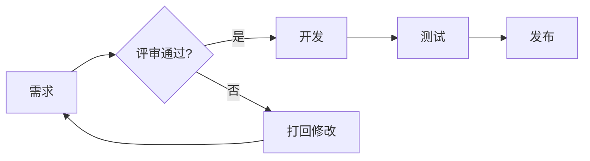

子图（subgraph）分组、虚线箭头(`-.->`)、带文字箭头(`-->|文字|`)、样式按节点 id 指定（`class A red;` 配 `classDef red fill:#fee`）。

### 9.3 时序图（Sequence）

参与者之间的消息时序。`participant` 声明角色，`->>` 实线实心箭头、`-->>` 虚线、`--)`/`--)` 异步、`x` 失败。`activate`/`deactivate` 显示激活条，`Note over/aside` 加注释，`loop`/`alt`/`opt`/`par` 分组。

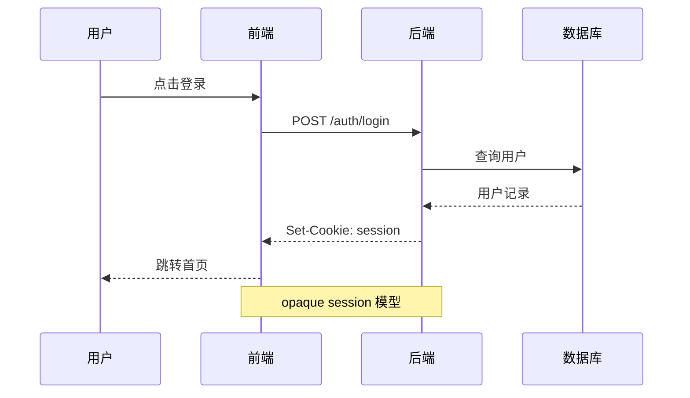

### 9.4 类图（Class Diagram）

UML 类关系。`class` 定义类（属性 `+`public/`-`private/`#`protected），关系：`<|--` 继承、`*--` 组合、`o--` 聚合、`-->` 关联、`..>` 依赖、`..|>` 实现。

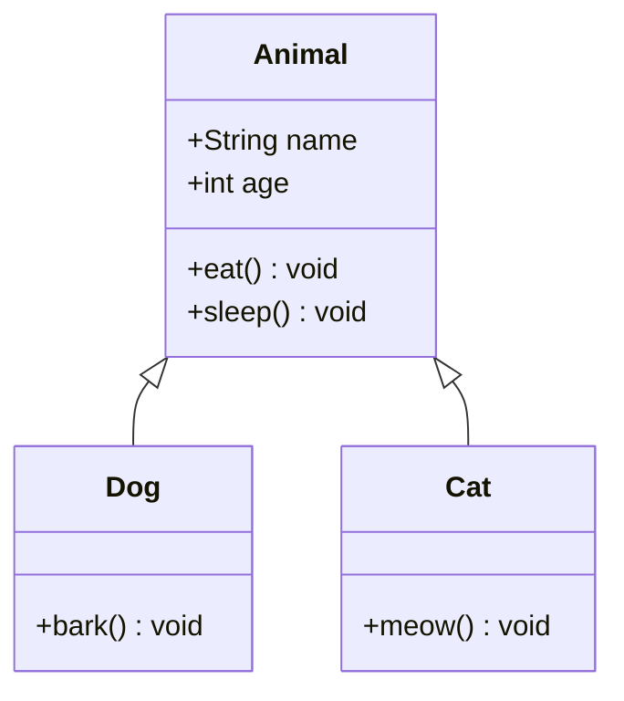

### 9.5 状态图（State Diagram）

状态机。`stateDiagram-v2` 起头（v2 语法更全），`[*]` 表示起止状态，`A --> B: 触发条件`。`note` 加注释，复合状态用 `state 名称 {...}` 嵌套。

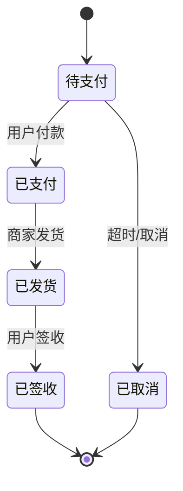

### 9.6 实体关系图（ER Diagram）

数据库表关系。`实体A ||--o{ 实体B : "关系名"`，连接符四段：基数（`||` 一对一、`}|` 一对多强制、`o{` 零对多）+ 关系线。字段在实体 `{}` 内，`PK`/`FK` 标主外键。

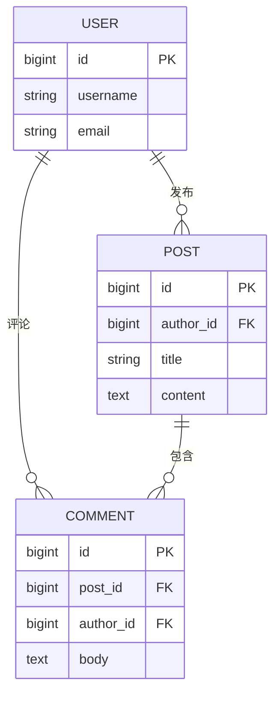

### 9.7 甘特图（Gantt）

项目排期。`dateFormat` 指定日期格式，`section` 分组，任务语法 `名称 :状态, id, 起始, 持续`。状态 `done`/`active`/`crit`/空（待办），`after id` 表示依赖前序任务。

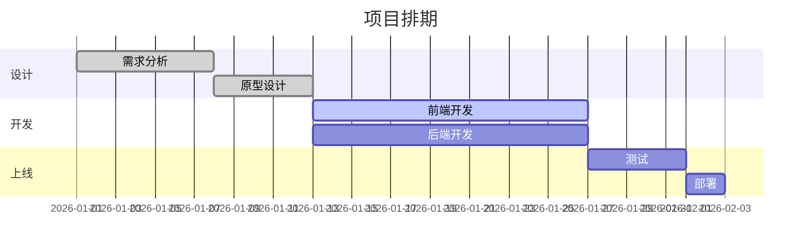

### 9.8 饼图（Pie Chart）

占比可视化。`pie title 标题` 起头，每行 `"标签" : 数值`。

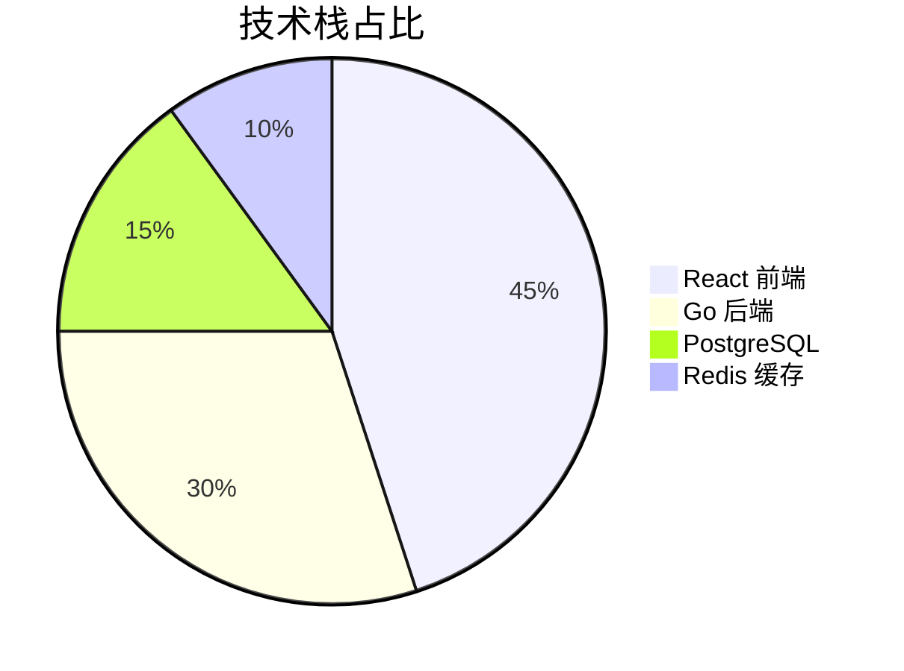

### 9.9 用户旅程图（User Journey）

体验地图，按步骤打分（0-5，越高越满意）。`journey title` 起头，`section` 分阶段，每行 `任务名: 分数: 参与者`。

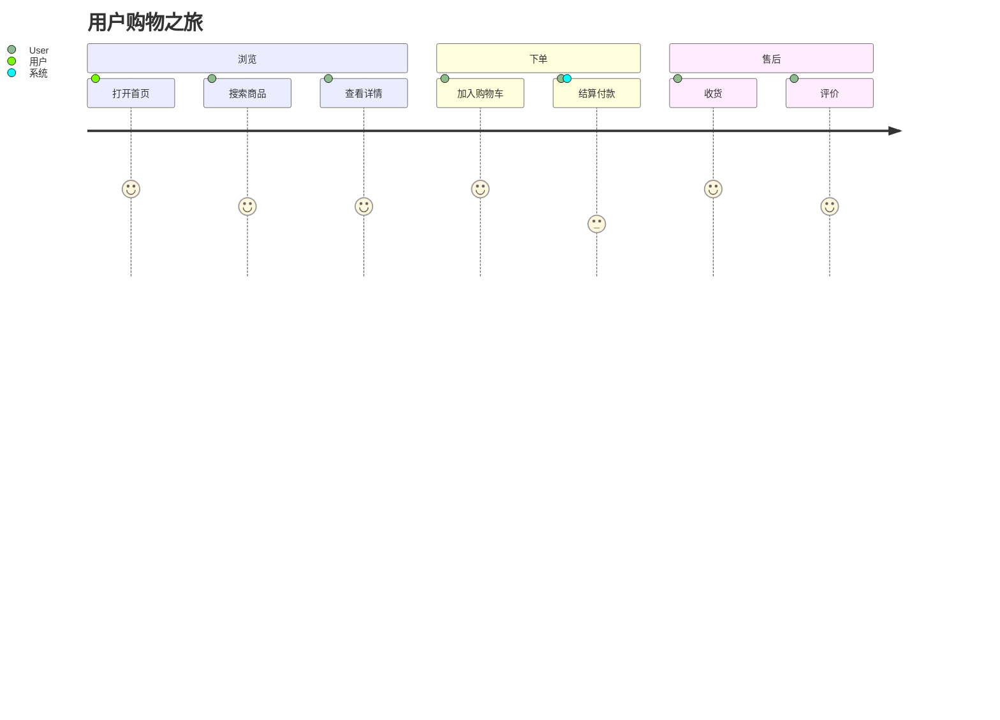

### 9.10 思维导图（Mindmap）

树状发散。`mindmap` 起头，缩进表达层级（不同深度的节点形状可用 `((圆形))`、`[方形]`、`(圆角)` 区分）。

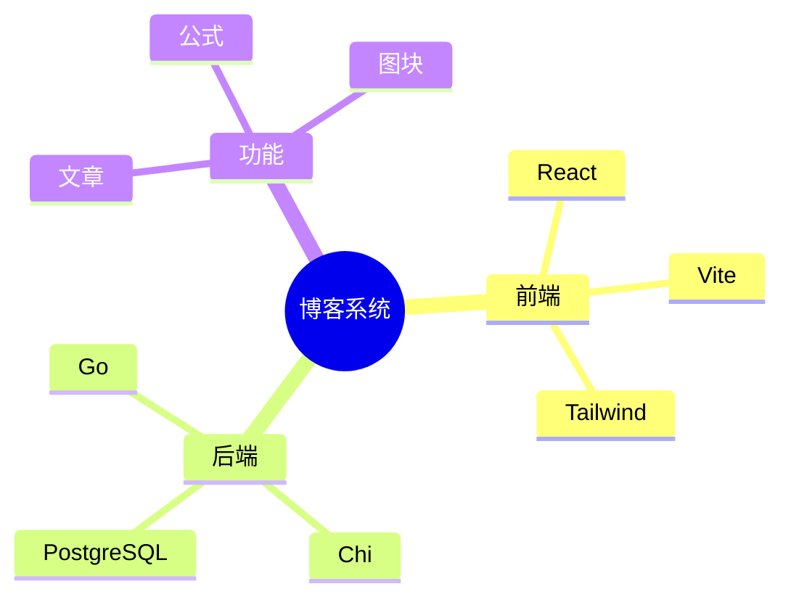

> 思维导图靠缩进定层级，**必须用空格缩进**（与编辑器整体 4 空格缩进一致），不要混 Tab。

### 9.11 时间线（Timeline）

按时间排列的事件。`timeline title` 起头，`时间段 : 事件`，同一时间段下多事件换行缩进。

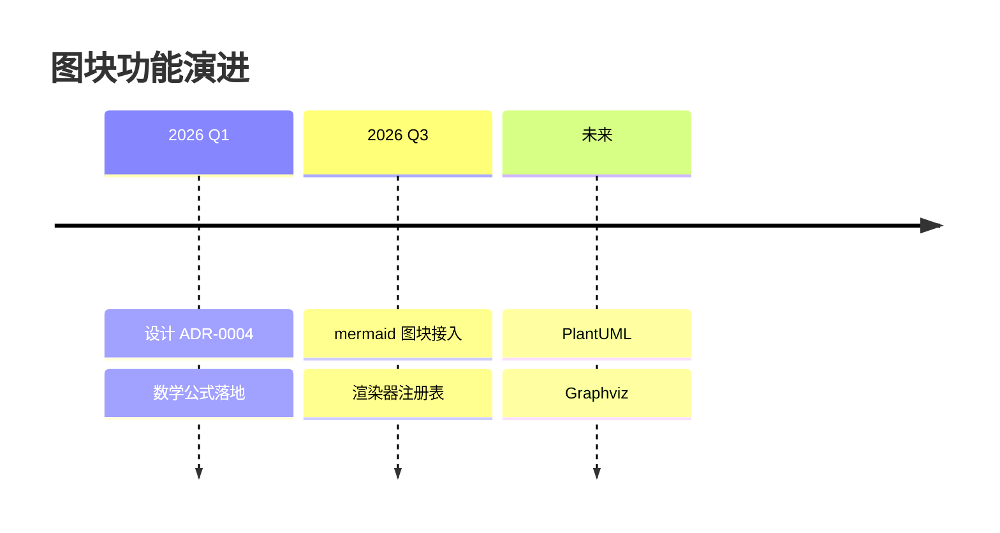

### 9.12 Git 图（Gitgraph）

分支与提交历史。`gitGraph` 起头，`commit` 提交、`branch 名称` 建分支、`checkout 名称` 切换、`merge 名称` 合并。提交可加 `id:`/`tag:`/`type:`（NORMAL/REVERSE/HIGHLIGHT）。

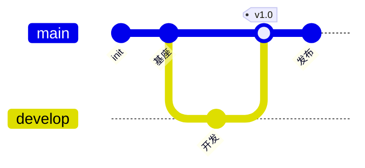

### 9.13 象限图（Quadrant Chart）

四象限定位。`quadrantChart title` 起头，定义 `x-axis`/`y-axis`、四个 `quadrant-N` 标签，数据点 `名称: [x, y]`（0-1 归一化坐标）。

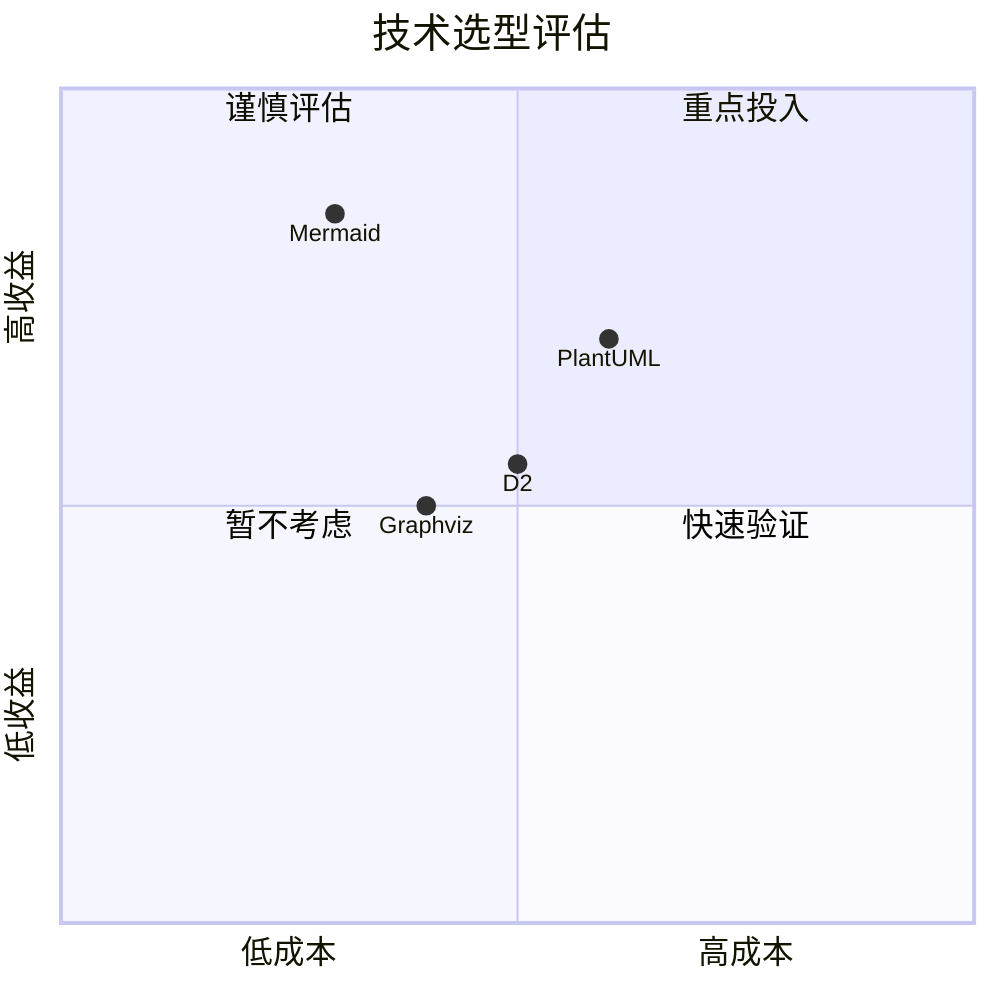

### 9.14 数值图表（XYChart）

柱状 / 折线图（beta，语法稳定中）。`xychart-beta` 起头，`title`、`x-axis` 标签数组、`y-axis "名称" 下限 --> 上限`，`bar [...]`/`line [...]` 数据。

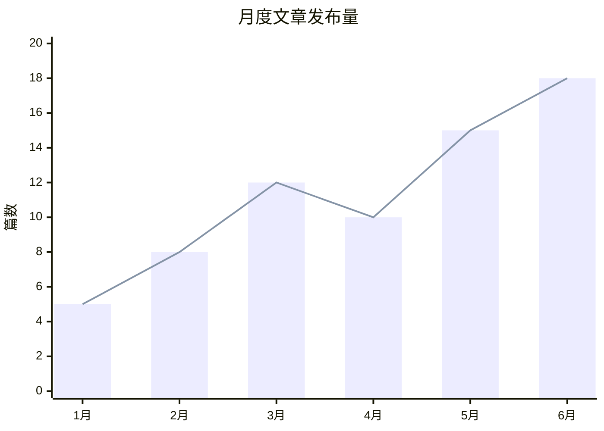

> 还有 C4 架构图、需求图（Requirement）、桑基图（Sankey）、看板（Kanban）、数据包（Packet）等更小众类型，语法见 [mermaid 官方文档](https://mermaid.js.org/intro/)，渲染管线一致。

### 9.15 渲染与安全

- **浏览时渲染**：content_html 只存语义化标记 `<div data-type="diagram-block" data-format="mermaid" data-source="...">`，最终 SVG 在读者浏览器渲染，不烘焙进 HTML（体积小、主题可跟随、源码可搜索可复制、升级渲染器不动存量数据）。
- **双重 XSS 防线**：全局 `securityLevel: strict` + render 产物经 DOMPurify 二次清理。mermaid 支持 per-diagram `%%{init}%%` 指令覆盖全局 strict（docmost CVE-2026-23630 的存储型 XSS 攻击路径），第二道 DOMPurify 兜底剥除 `<script>`、`on*` 事件属性、`foreignObject` 可执行内容。
- **主题重渲染**：mermaid 把颜色烘焙进 SVG，切主题需重新渲染（非 CSS 跟随）。组件持有 source，主题变化时重新 initialize + 重渲染所有可见图块。

### 9.16 渲染器注册表（扩展机制）

图块通过 **`format → 渲染器`** 注册表支持多格式扩展，收敛了原本散落在阅读端的 if/else 分发。新增图表格式只需：

1. 在 `shared/ui/diagram/` 注册表登记一个渲染器组件（含 lazy 加载、主题适配、错误降级）
2. 扩展 `diagramBlock` 节点的 `format` 属性取值
3. Slash 菜单与围栏 info string 增加对应入口

分发逻辑集中在注册表，不散落在分发代码里，互不影响。

### 9.17 其它图表格式（路线图）

上面 9.2-9.14 都是 mermaid 一种格式内的图类型。图块的 `format` 属性还支持接入**其它独立的图表语言**（每种自带渲染器）。下表穷举业界主流格式，按渲染路径分组——纯前端渲染的接入成本低（注册 lazy 组件即可），需服务端的要评估渲染服务部署。

#### 纯前端渲染（浏览器内，无需后端）

| 格式 | info string | 渲染依赖 | 适用场景 | 状态 |
|---|---|---|---|---|
| Mermaid | ` ```mermaid ` | mermaid.js | 见 9.2-9.14，覆盖最广 | **首期实现** |
| Graphviz (DOT) | ` ```dot ` 或 ` ```graphviz ` | viz.js (Wasm) | 通用有向 / 无向图、依赖图、状态机，学术与图谱可视化 | 规划中 |
| D2 | ` ```d2 ` | @terrastruct/d2（Wasm 或 JS） | 现代架构图，多布局引擎，语法比 mermaid 更适合复杂拓扑 | 规划中 |
| nomnoml | ` ```nomnoml ` | nomnoml | UML 类图专用，极简语法，适合快速类关系 | 规划中 |
| Excalidraw | ` ```excalidraw ` | @excalidraw/excalidraw | 手绘风格草图 / 白板，SVG/JSON 源 | 评估中 |
| Markwhen | ` ```markwhen ` | markwhen | 时间线 / Gantt / 项目里程碑，Markdown 风语法 | 评估中 |

#### 需服务端渲染（前端发源码，后端返回 SVG/PNG）

这些格式依赖 Java / 二进制运行时或大型布局引擎，浏览器内渲染成本过高，走后端渲染服务。部署可选自建渲染服务（如 PlantUML Server、Kroki）或对接 [Kroki.io](https://kroki.io) 公共实例。

| 格式 | info string | 运行时 | 适用场景 | 状态 |
|---|---|---|---|---|
| PlantUML | ` ```plantuml ` | Java | 全 UML 覆盖（类 / 组件 / 部署 / 时序 / 活动），企业生态成熟 | 规划中 |
| Structurizr DSL | ` ```structurizr ` | Java | C4 模型架构图（上下文 / 容器 / 组件），单一模型多视图 | 评估中 |
| Blockdiag | ` ```blockdiag ` | Python | 简单框图 / 网络图 / 时序图，日系生态 | 评估中 |
| ditaa | ` ```ditaa ` | Java | ASCII 草图转结构图，嵌入式文档常用 | 评估中 |
| Pikchr | ` ```pikchr ` | C 二进制 | PIC 风格精确布局，Fossil 文档系统原生 | 评估中 |
| DBML | ` ```dbml ` | JS（@dbml/core） | 数据库 schema（ER 图），DBDiagram 语法 | 评估中 |

> **Kroki 统一渲染网关**：上述服务端格式可通过部署 [Kroki](https://kroki.io) 一个服务统一承接（支持 PlantUML / Graphviz / D2 / Blockdiag / ditaa / Pikchr / DBML / Structurizr 等十余种格式），减少自建多种运行时的成本。未来接入服务端格式时，建议优先评估 Kroki 而非逐个自建。

> 新增格式的优先级与排期见 issue 跟踪。

### 9.18 容错与降级

- **语法错误**：编辑器内显示 mermaid 报错信息（便于作者定位）；阅读端降级为「图表渲染失败」占位 + 折叠的源码（不向读者暴露详细错误）。
- **无 JS 环境**：显示 mermaid 源码文本（源码本身可读，与公式降级一致）。
- **未知 format**：注册表查不到对应渲染器时，降级显示 source 文本。

---

## 10. Markdown 快捷输入（输入规则）

输入即转换，无需菜单：

| 输入 | 得到 |
|---|---|
| `#`+空格 / `##` / `###` | 标题 |
| `>`+空格 | 引用块 |
| `-`+空格 / `*`+空格 / `1.`+空格 | 列表 |
| `- [ ]`+空格 | 任务列表 |
| ` ``` `+语言+回车 | 代码块 |
| `---` | 分割线 |
| `**文本**` `*文本*` `~~文本~~` `==文本==` `` `代码` `` | 行内样式 |
| `$$公式$$`（段内）/ `$$$公式$$$`（行首三美元） | 公式节点 |
| ` ```mermaid ` 围栏 | 流程图（图块，见 §9） |

> 单 `$公式$` 在键入时不会即时转换，但粘贴/MD 导入时有效；手动插入走 Slash 菜单最稳。

## 11. Slash 菜单

任意位置输入 `/` 唤起，支持关键词/中文模糊搜索。共 15 项，按组：

- **基础**：正文、一/二/三级标题
- **列表**：无序、有序、任务列表
- **块**：引用、代码块、分割线、表格（3×3 带表头）
- **媒体**：行内公式、公式块、图片、流程图

> H4–H6、对齐、颜色、链接、行内样式、撤销重做等不在 Slash 菜单——只在工具栏/气泡菜单。

## 12. 存储与有损说明（重要）

- **content_html 是展示权威源**：下划线、文字颜色、高亮颜色、对齐这些 Markdown 表达不了的样式只存在这里，文章页始终正确。
- **content_md 是有损的**：上述样式在 Markdown 导出/降级展示时会丢失（加粗/斜体/删除线/高亮标记保留）。公式、代码块、表格、任务列表、图片、图块（mermaid 围栏）在两条路径间无损往返（round-trip 测试保障）。
- 旧 Markdown 文章走降级渲染路径（react-markdown + remark-math），公式渲染与主路径同一套 KaTeX 组件，视觉一致。

## 13. 暂不支持

- 脚注、上标下标（正文文本）、Wiki 链接、HTML 混排（降级路径不解析原始 HTML）。

