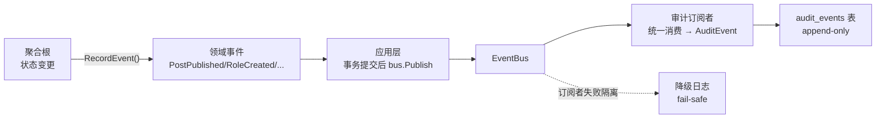

# PRD: 操作日志模块重构（audit 推倒重做：事件驱动 + 结构化审计）

## Problem Statement

操作日志（audit）模块搭了 DDD 四层骨架 + `audit_logs` 表 + 后台查询页 + `log:view` 权限，但**实质不起作用**：后台只能看到「管理员增删改了几个用户」，最该审计的文章发布、评论审核、角色权限变更、登录登出**一条没记**。

根因是**接口设计本身就是反模式**：

```go
// 8 个 string 位置参数，顺序极易搞错
Log(ctx, action, resource, resourceID, resourceName, userID, ip, ua string)
```

- **位置参数地狱**：改一个签名全站跟着改一遍（issue #38 想补一个 `resourceName` 参数就痛不堪言），没有结构化可言。
- **手工注入**：覆盖面完全靠 service 作者自觉注入 `AuditLogger`——useradmin 注了 7 处，role/announcement/post/auth **零注入**。
- **无 before/after 内建**：每个 service 自己拼 `map[string]any`，update 操作直接传 `nil`，看了等于没看。
- **fail-silent**：全部 `_ = s.auditSvc.Log(...)`，写库失败无声丢失。
- **EventBus 是死代码**：`domain/shared/event.go` 定义了完整领域事件，注释明写「写审计日志」，但 `EventBus` 接口只有 `Publish`、唯一实现是 `NoopEventBus`（直接丢弃），**连 Subscribe 机制都没有**。

## Solution

**推倒重做。** 不是在烂接口上补参数，而是按审计日志最佳实践从零设计。四层代码 + `audit_logs` 表 + 前端全部重写。

### 核心设计：领域事件驱动 + 结构化 AuditEvent



**1. EventBus 加 Subscribe 机制（改造入口）**

当前 `EventBus` 接口只有 `Publish`，唯一实现 `NoopEventBus` 丢弃事件。改造：
- 接口加 `Subscribe(eventName string, handler EventHandler)` 方法。
- 新增内存同步实现（MVP，不引入 MQ）：内部 `map[eventName][]handler`，`Publish` 按 EventName 路由，单 handler 失败隔离不影响其他。

**2. 结构化 AuditEvent（替代 8 参数 Log）**

废弃 `Log(ctx, action, resource, resourceID, resourceName, userID, ip, ua string)`，换成结构化事件——审计五要素作为一等公民：

```go
type AuditEvent struct {
    EventID    uuid.UUID            // 幂等去重
    Action     Action               // 受控枚举：create/update/delete/publish/login/...
    Actor      Actor                // 操作人：UserID + UserName快照 + IP + UA
    Resource   ResourceRef          // Type + ID + Name快照
    Changes    []FieldChange        // before→after 一等公民（非 map[string]any 兜底）
    Metadata   map[string]any       // 兜底（无法结构化的额外信息）
    OccurredAt time.Time
}
```

**3. 聚合根 RecordEvent + 应用层发布**

- 聚合根在状态变更方法（`Publish()`/`Archive()`/`ChangeRole()`）里 `RecordEvent`。
- 应用层 command/service 在事务提交后调 `bus.Publish(ctx, agg.PullEvents())`。
- 审计订阅者统一消费 → 转 AuditEvent → 写库。**调用方零样板**，不再每个 service 写 N 行手工审计。

**4. append-only 不可变存储**

审计日志按定义不可变（[Harness](https://www.harness.io/blog/complexities-of-building-audit-logs)：「Audit Logs Are Forever」）。新表从设计起 append-only：只 INSERT，应用层 + DB 层禁止 UPDATE/DELETE。

**5. fail-safe 可靠性**

审计订阅者写库失败时记结构化降级日志（zerolog Error + 完整事件快照），不吞失败。

## User Stories

1. 作为站长，后台审计页要能看到全站操作——文章发布/归档、角色权限变更、公告管理、登录登出，而不是只有用户管理。
2. 作为站长，审计日志的 update 操作要带 before→after 变更内容，不是空 detail。
3. 作为站长，审计日志的 resource 要带资源名称（文章标题/用户名快照），不用再去查 ID。
4. 作为站长，审计写入失败时系统日志要能看到降级告警，不是无声丢失。
5. 作为开发者，审计覆盖面由领域事件统一驱动——聚合根发事件就自动审计，不靠每个 service 作者记得手工注入。
6. 作为开发者，审计调用方零样板——不再每个 service 写 7 行 `s.auditSvc.LogWithDetail(ctx, ...)`。

## Implementation Decisions

### 推倒范围（全删重建）

| 删除 | 重建 |
|---|---|
| `domain/audit/entity.go`（AuditLog + AuditStore 端口） | `AuditEvent` + `AuditStore`（append-only） |
| `application/audit/service.go`（Log/LogWithDetail 位置参数） | `application/audit/subscriber.go`（EventBus 订阅者，消费领域事件） |
| `infrastructure/persistence/gorm/audit_store.go` | 新 store（append-only，写 AuditEvent） |
| `interfaces/http/handler/audit/audit.go` | 新 handler（适配新读模型） |
| `useradmin.AuditLogger` 接口 + 7 处手工调用 | 删除，由事件驱动替代 |
| migration 030（`audit_logs` 表） | migration 064 drop + 065 create 新表 |
| 前端 `web/src/features/admin-audit-logs/` | 按新读模型重建 |

### EventBus 改造（第一优先级）

- `application/shared` 的 `EventBus` 接口加 `Subscribe(eventName, handler)`。
- `infrastructure` 层新增内存同步 EventBus 实现（`map[eventName][]EventHandler`），单 handler 失败隔离。
- `NoopEventBus` 保留（测试用），默认装配改用真正实现。

### AuditEvent 结构（受控枚举 + before/after 一等公民）

- `Action` 为受控枚举类型（编译期约束 `create/update/delete/publish/archive/login/logout/...`），一旦发布不改名（Harness 血泪教训）。
- `Changes []FieldChange`（`{Field, From, To}`）是一等公民，update 类事件必填。
- `Actor` / `Resource` 为结构体，UserName/ResourceName 是**写入时快照**（用户/文章删除后仍可追溯）。

### 聚合根事件 + 应用层发布

- `domain/shared` 提供 `AggregateRoot` 基类（`RecordEvent` + `PullEvents`）。
- `domain/post`、`domain/role`、`domain/announcement`、`domain/useradmin` 聚合根在状态变更方法 RecordEvent。
- 事件类型定义在各 domain 包（`domain/post/events.go` 等）。
- 应用层在事务提交后 `bus.Publish(ctx, agg.PullEvents())`。

### 数据库迁移（连续 migration 链，部署安全）

migration 到 063，新 migration 从 064 起：

- **migration 064**：`DROP TABLE audit_logs`（老表 schema 不适配新 AuditEvent 结构，且当前基本无有效数据；作为破坏性变更独立可 revert）。
- **migration 065**：`CREATE TABLE audit_events`（append-only 设计：无 UPDATE 路径；加索引 actor_user_id / action / resource_type / occurred_at DESC）。
- 两个 migration 独立可 revert，部署时顺序执行即可。

### 装配（wire）

- `app` 层装配：创建真正 EventBus → 注册审计订阅者 → EventBus 注入各需要发事件的 handler。
- `make wire` 重新生成。

## Testing Decisions

- **EventBus 实现**：Subscribe 注册、Publish 按 EventName 路由、handler 失败隔离、多 handler 执行。
- **审计订阅者**：收到领域事件 → 转换为 AuditEvent → 写库正确；before/after 从事件 payload 提取。
- **聚合根**：状态变更后 PullEvents 含正确事件类型 + 字段。
- **AuditStore**：append-only 往返（写 → 读回字段一致）。
- 不测：PG jsonb 语义、zerolog 输出格式。

## Out of Scope

- **审计日志保留期 + 冷数据归档**：P2（近期热数据留 DB，冷数据归档，Harness 建议分层访问）。
- **审计搜索 API + webhook 事件流**：P2（Design for API，schema 预留但本 PRD 不实现）。
- **评论审核/删除接入审计**：评论审核有独立后台流程，优先级低，留后续。
- **GET 操作审计（敏感数据访问）**：暂不做，仅记状态变更（POST/PUT/PATCH/DELETE 语义）。

## 改动拆分（重新拆 issue）

旧 issues #38–#45 已关闭（渐进式补参数方向作废）。新拆分按「基础设施 → 事件接入 → 前端」推进：

| Issue | GitHub | 内容 | 依赖 |
|---|---|---|---|
| 1 | #48 | EventBus 加 Subscribe + 内存实现（基础设施） | 无 |
| 2 | #46 | AuditEvent 结构 + AuditStore（domain + infra，append-only） | 无 |
| 3 | #47 | 数据库迁移 064（drop audit_logs）+ 065（create audit_events） | 2 |
| 4 | #50 | 审计订阅者（消费领域事件 → AuditEvent → 写库）+ fail-safe 降级 | 1, 2 |
| 5 | #49 | 删除旧 audit 四层代码 + useradmin AuditLogger 手工调用 | 2, 4 |
| 6 | #51 | post 聚合根事件 + 应用层发布接入 | 1 |
| 7 | #54 | role/permission 聚合根事件 + 应用层发布接入 | 1 |
| 8 | #53 | announcement 聚合根事件 + 应用层发布接入 | 1 |
| 9 | #52 | auth login/logout 事件接入 | 1 |
| 10 | #55 | useradmin 聚合根事件 + 应用层发布接入（替代旧手工调用） | 1, 5 |
| 11 | #57 | HTTP handler + 路由 + OpenAPI（适配新读模型） | 2, 5 |
| 12 | #56 | 前端 admin-audit-logs 推倒重建（新读模型） | 11 |

1/2 可并行；3 依赖 2；4 依赖 1+2；5 依赖 2+4；6-10 依赖 1（可并行）；11 依赖 2+5；12 依赖 11。

## 难逆决策

- **推倒重做而非渐进补丁**：老接口（8 位置参数 + 手工注入）是反模式，补参数只会越补越烂。全删重建。
- **EventBus 同步分发 MVP**：先做内存同步版，不引入 MQ（YAGNI）。异步队列待性能需求驱动。
- **老 audit_logs 表 drop 重建**：schema 不适配新结构，且基本无有效数据。作为破坏性 migration 独立可 revert。
- **Action 受控枚举**：编译期约束，一旦发布不改名（Harness：改 log type 等于丢历史）。
- **Changes 为一等公民而非 map 兜底**：update 类事件的 before/after 是审计灵魂，结构化优先。

## 业界参考

- **审计日志五要素 + before/after 是灵魂**：[Making audit logs sexy (dev.to, Chris Dermody)](https://dev.to/chipd/making-audit-logs-sexy-best-practices-for-audit-logging-with-examples-1pab)
- **Audit Logs Are Forever + Design for generic + Design for API**：[The Surprising Complexities of Building Audit Logs (Harness/Split)](https://www.harness.io/blog/complexities-of-building-audit-logs)
- **fail-safe over fail-open**：[Audit Log Best Practices For Information Security (zengrc)](https://www.zengrc.com/blog/audit-log-best-practices-for-information-security/)
- **领域事件驱动审计**：项目自有 `domain/shared/event.go` 已定义 DomainEvent，注释明写「写审计日志」——本 PRD 把这个死设计激活。
