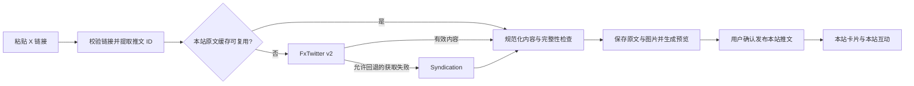

# PRD：X 推文免凭据转发

状态：已实现，并通过本地隔离环境的发布、互动、聊天分享和下架联调；生产网络、部署缓存和线上完整流程尚未验收。

日期：2026-09-28。功能分支：`feat/tweets-x-repost`，基于 `release/2.0`。本 PRD 与后续实现保留在同一功能分支。

## 用户要完成什么

用户在 `/tweets` 粘贴一条真实 X 推文的链接，预览原文，可选填写自己的转发感想，然后发布到本站。本站保存原文内容与图片，以站内卡片渲染原作者、正文和媒体。其他用户可以对这条本站转发评论、点赞、引用和分享，也可以点击原文链接前往 X。

这条转发拥有独立的本站推文 ID。本站转发者、转发时间、评论和点赞属于本站推文；原作者、原文时间和原文内容属于引用的 X 推文，两者在界面和数据模型中分开。本站的互动不回传 X，也不与 X 的互动计数相加。

“免凭据”指 Violet 服务端不配置 X API Key、Bearer Token 或账号 Cookie，用户也不需要绑定 X 账号。Violet 调用公开可访问的数据服务；这些服务如何访问 X，由服务提供方维护。本站自身的发布登录态和权限检查仍然保留。

## 首版范围

| 能力 | 首版行为 |
| --- | --- |
| 普通文本推文 | 保存规范化正文、原作者、原文时间和来源链接 |
| 长推文 | 仅在能确认拿到完整正文时允许发布；截断或完整性未知时提示重试、查看原文 |
| 图片推文 | 保存原图到本站存储，支持多图和现有图片预览 |
| 视频、以 MP4 承载的 GIF | 保存封面，显示媒体类型，点击前往 X；不下载和播放完整视频 |
| X 引用推文 | 展示一层被引用原文；更深层仅保留来源链接 |
| 转发感想 | 可为空；非空时沿用本站推文的 500 字限制 |
| 站内评论、点赞、引用、分享 | 复用现有推文能力，关联本站推文 ID |
| 原文跳转 | 卡片内提供明确的“在 X 查看原文”入口 |
| 原文更新或失效 | 刷新共享原文记录；失效后保留本站讨论及来源占位 |

首版处理单条推文，不自动导入整串 thread、账号时间线或关注关系。投票、直播、X Articles 等无法完整表达的内容标注后引导查看原文。不引入浏览器自动登录、账号 Cookie 池、付费 X API、Node 抓取侧车或通用多平台抓取框架。

## 数据源与已验证事实

### 获取顺序

首选 FxTwitter v2，失败时按错误类型决定是否尝试 Syndication。两种结果统一转换为本站的数据结构，前端不感知供应商协议。



**FxTwitter v2**：服务端请求 `GET https://api.fxtwitter.com/2/status/{id}`，同时检查 HTTP 状态和 JSON 中的 `code`。v2 推文对象在 `status` 字段，不能按旧版 `tweet` 字段读取。适配器处理 `text`、`raw_text`、作者、媒体、引用原文和 tombstone，按源数据表达是否有完整长文，不能只因接口成功就认定正文完整。[API 说明](https://docs.fxembed.com/api/introduction/)、[v2 推文接口](https://docs.fxembed.com/api/twitter/operations/2statusid/)。

**Syndication**：服务端请求 `https://cdn.syndication.twimg.com/tweet-result`，参考 `react-tweet` 当前实现构造 ID、语言、token 及所需参数。这里的 token 是由推文 ID 计算出的查询参数，不是账号凭据；它的存在也不意味着接口有稳定性保证。其 `note_tweet` 可能只有 ID，普通 `text` 不能因此视为完整长文。[获取实现](https://github.com/vercel/react-tweet/blob/main/packages/react-tweet/src/api/fetch-tweet.ts)、[响应类型](https://github.com/vercel/react-tweet/blob/main/packages/react-tweet/src/api/types/tweet.ts)。

Syndication 的参考 token 算法为：

```javascript
((Number(id) / 1e15) * Math.PI).toString(36).replace(/(0+|\.)/g, '')
```

在 Go 适配器中实现时，用固定样本核对与 JavaScript 浮点运算、进制转换的兼容性。不要把简单的整数除法或整数 36 进制转换当作等价实现。这个兼容细节只留在适配器内；数据库、JSON 和业务代码中的 X ID 始终使用字符串。

首版使用公开 FxTwitter 服务，不自行部署。其自部署文档说明，使用 X 账号凭据能改善访问能力；“能自行部署”不能推导出“无凭据自部署与公开实例能力相同”。[自部署凭据说明](https://docs.fxembed.com/deployment/credentials/)。

### 2026-09-28 探测记录

开发机直接请求两个数据源，未发送 Authorization 或 Cookie，得到以下结果。这些结果只证明当时开发机网络下的少量样本可取，不代表生产环境或全部推文类型已验收。

| 推文 ID | FxTwitter v2 | Syndication | 样本覆盖 |
| --- | --- | --- | --- |
| `20` | HTTP 200，业务 code 200，返回正文 | HTTP 200，返回正文 | 普通文本 |
| `1228393702244134912` | HTTP 200，业务 code 200，返回正文 | HTTP 200，返回正文 | 普通文本 |
| `2040511285998313827` | HTTP 200，业务 code 200，返回视频元数据 | HTTP 200，返回视频元数据 | 视频与封面信息 |

第三个样本两个数据源的 `text` 长度不同。媒体链接占位符和展示范围可能影响长度，不能直接据此认定某一方截断。需结合 `raw_text`、facets 和正文完整性标记进行规范化。

方案探测阶段对样本头像和视频封面的 `pbs.twimg.com` 地址执行 HEAD，均返回 HTTP 200、`image/jpeg`。实际下载、解码、落盘与浏览器加载的后续结果见末尾「本地验收记录」。完整长文、X 引用、编辑、删除和私密状态仍需补充真实网络样本。

### 内容保留边界

公开接口可访问，不等同于获得永久复制授权。X 的开发者政策对更新、删除以及自定义展示的数据来源有要求，其中非官方组件的自定义展示涉及使用 X API 获取当前内容。免凭据公开服务路线不能据此宣称满足官方 API 的全部要求；需保留署名、来源链接、刷新和下架能力，后续上线前核对当时适用的来源条款。[X 开发者政策](https://docs.x.com/developer-terms/policy)。

本方案的“保存”是可更新、可撤回的站内内容缓存。定时检查无法保证发现 X 上的每次变化，不承诺永久归档或原文删除后的持续展示。收到有效的内容移除请求时应尽快处理，不能等待下一轮定时刷新。

## 用户流程与卡片交互

1. 在现有发布器增加“转发 X 推文”入口。粘贴 X 链接时也可提示使用该入口；普通正文中的链接仍可按原样发布，不自动转换或自动提交。
2. 用户输入链接，服务端校验并获取内容，完成必需图片保存后返回预览。
3. 预览展示原作者、原文时间、正文、图片或视频封面，以及不能在本站完整呈现的内容提示。用户可填写转发感想。
4. 用户点击发布，服务端使用预览凭证创建本站推文，时间线显示“本站用户转发了 X 推文”。
5. 用户在本站详情参与互动，或通过来源入口打开 X。

预览加载、失败、取消或更换链接时，保留已写的转发感想。更换链接后取消旧请求或丢弃旧响应，不能用后到达的旧预览覆盖新链接。预览过期或原文版本变化时重新确认预览，不静默发布另一份内容。

| 点击位置 | 行为 |
| --- | --- |
| 本站推文卡片主体、评论入口 | 进入 `/tweets/{本站推文 ID}` |
| 原作者资料链接 | 打开 X 上的原作者页面 |
| “在 X 查看原文” | 打开规范化后的原推文 URL |
| 已保存图片 | 打开本站图片预览 |
| 视频封面上的查看入口 | 打开 X 原推文 |
| 本站点赞、引用、分享按钮 | 操作本站推文 |

内层链接和按钮阻止触发外层卡片跳转，保留键盘焦点和原生链接语义。首版不显示 X 点赞、转发和回复计数，避免与本站计数混淆。第三方正文以文本和受控片段渲染，不插入第三方 HTML、iframe 或 `widgets.js`。

界面沿用 `/design-system` 的 token 与组件选型；功能圆角不超过 `rounded-2xl`，不使用硬投影或常规缩放、滑入动效。桌面、移动端和键盘操作均纳入验收。

## 数据模型与不变量

### 共享原文记录

新增 `external_tweets`，保存 X 原文的当前有效快照。多名本站用户转发同一条原文时共用该记录，各自的本站推文和讨论独立。

| 字段 | 含义与约束 |
| --- | --- |
| `id` | 本站 UUID |
| `platform` | 首版固定为 `x`，不为未实现的平台扩展接口 |
| `source_id` | X 推文 ID，字符串；与 `platform` 建唯一约束 |
| `canonical_url` | 规范化后的 X 原文链接 |
| `snapshot` | 类型明确的 JSONB：作者、正文片段、原文时间、媒体清单、正文完整性等；不直接存储可执行 HTML |
| `quoted_external_tweet_id` | 可空，指向一层被引用原文；引用内容通过独立记录统一刷新和撤回 |
| `fetch_source` | 本次有效快照来自 `fxtwitter` 或 `syndication` |
| `snapshot_version` | 快照版本，用于预览绑定、媒体目录和缓存失效 |
| `availability` | `available`、`unavailable`、`deleted` 或 `private`；后两项要求明确证据 |
| `fetched_at` | 当前有效快照的获取时间 |
| `last_checked_at` | 最近一次检查时间，包括未成功获得新快照的检查 |
| `last_error` | 脱敏后的获取错误，供诊断使用，不原样返回客户端 |

正文完整性使用 `complete`、`partial`、`unknown`。只有已确认完整且必需媒体准备成功的内容可以生成可发布预览。缺少可选的头像或作者认证字段，不等同于正文不完整；这些字段按可用数据展示，不猜测认证状态。

作者信息不映射为本站用户，不创建虚构的本地作者账号。X 作者 ID 同样以字符串保存。引用原文只展开一层，循环或更深引用降为来源链接，不递归抓取整串内容。

### 现有本站推文

在现有 `tweets` 增加可空的 `external_tweet_id` 和 `client_request_id`。已有原创推文无需回填外部来源。

- 非空规则扩展为：正文、本站上传图片、本站引用 `quote_of`、X 来源四者至少有一项。
- `quote_of` 保持指向本站推文 UUID；一次新建请求不能同时指定 `quote_of` 和外部来源凭证。引用一条已经存在的 X 转发时，仍通过 `quote_of` 引用那条本站推文。
- 转发感想沿用 500 字限制；用户自行上传的图片沿用现有最多 4 张及所有权检查。原文正文和原文图片使用独立字段，不占这两个限额。
- 本站推文沿用现有不可编辑语义。共享原文记录可按来源变化更新，因此原文卡片可能刷新，本站转发感想与互动归属不变。
- 时间线按本站转发时间排序，不按 X 原文时间排序。
- `(author_id, client_request_id)` 对非空请求 ID 建唯一约束，防止同一次发布的双击和超时重试产生重复推文。
- 用户可以再次主动转发同一原文；新操作使用新的请求 ID，不用 `(author_id, source_id)` 禁止合理的再次转发。

幂等命中时先返回已经创建的本站推文，不因预览凭证已使用或过期而再次失败。同一请求 ID 携带不同发布内容时返回冲突，不能错误复用第一次结果。创建推文、建立来源关系和幂等记录在同一事务内完成；网络请求和图片下载不放进数据库事务。

### 删除与共享关系

删除本站转发只影响该条本站推文及其现有评论、点赞等关系，不删除其他用户转发，也不立即移除仍被引用的原文资源。

明确得知原文删除、转为私密或收到有效下架请求时，所有引用该原文的入口改为来源占位，移除可展示正文与媒体并失效相关缓存。本站转发感想和讨论保留。引用原文通过独立关联读取，不能在父快照里留一份不受撤回控制的正文副本。

已确认撤回的来源停止自动导入，父推文中的旧引用数据也不能重新恢复它。首版未提供撤回后的恢复操作。

预览取消或过期后留下的原文记录、临时媒体，在保留期结束且没有本站推文引用、有效预览或进行中的导入时清理。清理任务须与发布、刷新协调，不能在确认“无引用”后误删并发发布刚引用的文件。

## 接口与发布时序

### 生成预览

新增需要本站登录的 `POST /api/v1/tweets/external/preview`：

```json
{
  "url": "https://x.com/XDevelopers/status/1228393702244134912"
}
```

返回规范化的 `external_tweet` 预览、`preview_token`、`expires_at`、`can_publish` 和用户可理解的 `warnings`。实际字段以同步更新的 OpenAPI 契约为准。失败响应区分无效链接、原文不可用、正文不完整、媒体准备失败和临时数据源错误。

预览凭证存于 Redis，绑定当前用户、原文 ID、主原文及引用版本，有效期 15 分钟。其他用户不能使用该凭证。预览阶段可以写入原文缓存与源媒体，但不创建时间线推文，也不产生发布通知。

服务端负责获取、校验和保存原文。客户端不能提交原作者、正文、外部图片地址等内容来冒充抓取结果。只有可发布预览获得有效的发布凭证。

### 确认发布

扩展现有 `POST /api/v1/tweets`：

```json
{
  "content": "这条值得一看。",
  "images": [],
  "external_preview_token": "<server-issued-preview-token>",
  "client_request_id": "7d60b7b4-6c07-4ce5-b762-98a0553e5ec2"
}
```

纯转发时 `content` 为空。既有原创、图片和本站引用请求继续使用原有语义。对外部转发请求要求提供 `client_request_id`，旧客户端请求不因此被拒绝。

发布先处理幂等重试，再校验凭证归属、时效、原文可用状态、快照版本与发布内容。预览后原文发生变化时返回需要刷新预览的结果；不会在用户确认后悄悄换成另一份内容。成功事务提交后再触发现有发布事件和缓存更新。

### 列表、详情及派生入口

现有列表和详情 DTO 增加可空的 `external_tweet`，包含渲染需要的来源信息、当前状态及本地媒体地址。列表查询批量加载原文和一层引用，避免每张卡片单独查库或请求上游。

同一字段能力需要覆盖个人时间线、本站引用预览、详情页、分享对话框和聊天分享卡片。不能只在 `/tweets` 主列表补卡片，导致纯转发在其他入口显示空正文。

通知摘要优先使用本站转发感想，纯转发使用“转发了一条 X 推文”等固定摘要，不额外持久化难以统一撤回的 X 原文摘录。

## 链接解析与文本规范化

链接解析仅接受 HTTPS 的 `x.com`、`twitter.com` 及明确列入白名单的 `www`、`mobile` 变体。支持以下路径，去掉跟踪参数以及 `/photo/1`、`/video/1` 等展示后缀：

```text
/{username}/status/{id}
/i/status/{id}
/i/web/status/{id}
```

ID 只接受数字字符串并限制长度。输入 URL 的用户名不能作为原作者身份依据，作者和最终规范链接以校验后的来源数据为准。首版不自动展开 `t.co` 等短链，提示提供完整推文链接。

解析成功后，后端从 ID 构造固定数据源地址，不直接抓取用户输入的网址。拒绝 userinfo、非默认端口、伪装主机名、非 HTTPS 和不支持的路径。媒体下载另走严格的 CDN 白名单和现有防 SSRF 传输层，每次重定向也要重新检查。

规范化输出为正文和安全的链接、提及、话题片段：

- X 提及链接到 X 作者页面，不转换为本站 `@用户`。
- X 话题保留 X 链接，不自动加入本站话题索引；转发感想里的本站话题行为保持现状。
- 原文中的 `[xxx]` 不按本站自定义表情解释。
- 只有被源数据明确标识为媒体占位的链接才从显示正文中去除，不批量删除所有 `t.co` 链接。
- FxTwitter facets 使用 UTF-16 偏移，Go 的字节或 rune 索引不能直接代入；中文、emoji、组合字符与链接混排须有样本验证。
- 长文的 `partial` 或 `unknown` 状态阻止发布，保留感想并允许重试或去 X 查看，不静默保存成完整原文。

## 图片存储与资源生命周期

外部原文媒体归属于共享原文记录。不能挂到第一个转发者的个人文件名下，也不能绕过 `TweetImageChecker` 把外部图片伪装成用户上传。

复用现有存储和图片处理能力，单独保存来源媒体清单，记录类型、来源 URL、本地 URL、尺寸、替代文本及文件标识。保存路径：

```text
/uploads/external-tweets/{source-record-id}/{snapshot-version}/{filename}
```

本地保存对象包括原文图片、视频封面和可取得的头像。头像失败时使用本站文字占位，不能再依赖一个外部头像服务。正文照片或承诺展示的视频封面准备失败时，预览不可发布，保留草稿并允许重试；不要发布一条看似成功但必需图片缺失的转发。

首版图片源优先限定 `pbs.twimg.com`。根据经过验证的样本扩展白名单，而不是允许任意第三方返回的 URL。复用现有 `ssrf.NewSafeTransport` 对连接地址的保护，配合重定向检查、响应大小、MIME、实际解码及像素上限验证。图片处理器的格式转换、尺寸读取和缩略图能力可复用，个人文件删除和替换接口不直接操作这些共享资产。

下载先进入临时区，全部必需文件准备完成后提交快照及引用关系；失败清理本次新增临时文件。刷新新版本时先准备新内容，再原子切换当前版本。普通网络失败保留上一份完整快照，不能用半成品覆盖它。

内容明确撤回时，清理对应的原图、头像、封面、缩略图和旧版本可访问副本，失效列表、详情、引用与聊天展示缓存。若部署有 CDN 或其他存储缓存，删除流程也覆盖相应缓存。原文长期无人引用时由回收任务统一处理，避免个人文件操作误删共享内容。

## 失败处理、刷新与运行约束

### 错误分类

| 情况 | 获取与展示行为 |
| --- | --- |
| 链接格式错误或不支持的地址 | 直接提示，不请求上游 |
| FxTwitter 超时、5xx 或非内容终止类失败 | 在总耗时预算内尝试一次 Syndication |
| 上游限流 | 尊重 `Retry-After`，记录短期失败缓存；回退受本地限流与总耗时约束 |
| 明确的删除或私密 tombstone | 停止导入并撤回已保存展示内容，不通过另一数据源继续显示旧内容 |
| 404、空对象或无法解释的响应 | 标记暂不可用并允许后续重试，不能仅凭这些信号宣称原文已删除 |
| 正文不完整 | 不允许发布，说明当前无法获取完整正文 |
| 必需媒体下载或验证失败 | 不允许发布，保留感想并允许重试 |
| 既有内容刷新暂时失败 | 保留上次有效快照，记录检查失败，不删除本站讨论 |
| 已确认原文失效 | 全部引用入口显示来源占位，本站互动保留 |

临时错误与内容状态分开记录。已有有效快照不会因一次超时就变成“已删除”；没有有效快照的失败记录不能用于发布。疑似访问限制、明确私密或删除信息不能被回退源的陈旧结果覆盖。

### 初始运行参数

本次实现采用下列初始值。它们不是上游服务保证，上线前仍需按部署网络和流量验证。

| 项目 | 实现值 |
| --- | --- |
| 单次数据源请求超时 | 6 秒 |
| 单次媒体下载超时 | 15 秒，仍受整次导入预算约束 |
| 整次预览获取与媒体准备预算 | 30 秒 |
| 数据源 JSON 响应上限 | 2 MiB |
| 单张图片下载上限 | 10 MiB、2,000 万像素，校验实际格式与解码结果 |
| 一次导入的图片总量上限 | 32 MiB，计入引用原文媒体 |
| 同次导入的下载并发 | 3 |
| 单个服务进程的导入并发 | 4，同一原文 ID 合并请求 |
| 用户预览额度 | 每分钟 5 次、每日 50 次 |
| 预览凭证有效期 | 15 分钟 |
| 成功快照的直接复用窗口 | 1 小时 |
| 短期失败缓存 | 至少 30 秒，上游限流另尊重 `Retry-After` |
| 孤立记录与旧媒体回收 | 保留至少 24 小时，再检查有效预览、导入与引用关系 |

发布沿用既有每用户每小时 10 次请求的限流。并发重试也计入请求额度；应用层和数据库保证成功请求只创建一条推文。

同一原文 ID 的并发获取合并执行。每次预览最多按既定顺序请求两个数据源，不循环重试；短期错误缓存避免持续放大上游故障。外部下载使用独立的大小和时间预算，普通推文读接口不等待上游。

复用已有后台任务模式，对仍被引用的原文每日分批检查；活跃内容超过复用窗口时可触发后台刷新。重复预览可复用仍有效快照，不因每次页面浏览重新抓取。刷新任务要限流、分批并记录失败率，具体吞吐由部署环境验证。

“每日检查”是尽力发现变化的频率，不是对删除传播时限的保证。有效撤回请求走主动处理；来源未知或长期不可达时保留可诊断状态，由明确的内容状态决定是否继续展示。

## 与现有代码的衔接

当前实现已有推文、站内引用、评论、点赞、图片所有权检查及聊天分享。功能沿用这些能力，不新增一套独立的转发互动系统。

| 位置 | 已实现的衔接 |
| --- | --- |
| [推文领域](../../api/internal/domain/tweet/entity.go) | 增加外部来源关联与非空约束，原文状态、预览绑定及仓储契约归入该领域 |
| [推文应用服务](../../api/internal/application/tweet/service.go) | 扩展创建输入、DTO 和批量装配；编排预览、发布、刷新与撤回，外部请求通过窄接口调用 |
| [推文装配](../../api/internal/app/tweet_container.go) | 手工注入数据源适配器、原文仓储、存储与预览缓存；保留现有用户图片检查 |
| [推文持久化](../../api/internal/infrastructure/persistence/gorm/tweet_repo.go) | 配合新增迁移、共享原文模型、来源唯一约束和发布幂等约束 |
| `api/internal/infrastructure/xtweet/` | 封装 FxTwitter、Syndication 协议、错误分类、文本规范化、媒体准备与 Redis 预览缓存 |
| [安全传输层](../../api/internal/infrastructure/ssrf/checker.go)、[本地存储](../../api/internal/infrastructure/storage/local_storage.go)、[图片处理契约](../../api/internal/domain/upload/processor.go) | 复用传输、存储、解码和缩略图能力；新增来源资产用途，不绑定个人上传生命周期 |
| [HTTP 入口](../../api/internal/interfaces/http/handler/tweet/tweet.go)、[OpenAPI](../../api/internal/openapi/paths_tweet.go) | 增加预览路由、扩展发布契约，沿用本站认证、限流和错误返回约定 |
| [共享推文类型](../../web/src/entities/tweet/model/types.ts) | 扩展可选的外部来源与引用展示类型，统一各 feature 使用的字段 |
| [原文展示卡片](../../web/src/entities/tweet/ui/ExternalTweetCard.tsx) | 推文与聊天共用当前来源展示；已有手工文章嵌入卡片保留原契约 |
| [发布器](../../web/src/features/tweets/ui/TweetComposer.tsx)、[推文卡片](../../web/src/features/tweets/ui/TweetCard.tsx) | 接入链接预览、转发感想、提交状态和原文卡片，各时间线复用同一展示逻辑 |
| [聊天分享卡片](../../web/src/features/chat/ui/TweetShareCard.tsx)、[分享对话框](../../web/src/features/chat/ui/ShareTweetDialog.tsx) | 补充纯转发的显示、原文失效占位和来源跳转，扩展后端分享 DTO 与前端分享预览状态 |

前端原文展示组件只接收展示数据和回调；抓取、发布、查询缓存属于 `features/tweets`，不能放入 `shared`。若已有 feature 私有类型或逻辑需要被聊天复用，按仓库层级先移动到合适的公共层，再接入第二个 feature。

后台刷新和回收接入已有 job 生命周期，不引入新的调度系统。后端按 domain、application、infrastructure、interfaces 分工，外部 HTTP 和文件处理不进入领域实体。

## 交付顺序

1. **补齐数据源验证**：在部署环境验证两个来源及图片域名；补充完整长文、多图、引用、私密、删除、编辑和格式异常样本。明确完整性判定、错误映射、像素阈值和 Syndication token 兼容性。
2. **完成后端流程**：迁移、来源适配器、共享原文持久化、媒体准备、预览凭证、发布幂等、DTO、刷新与撤回形成闭环；已有原创和本站引用继续通过回归验证。
3. **完成公共展示组件**：支持原作者、来源时间、文本片段、多图、视频封面、引用与失效占位；复用文章嵌入能力时验证原有内容不退化。
4. **接入发布和全部展示入口**：发布器、时间线、详情、个人页面、本站引用、分享对话框和聊天分享一致支持外部来源。
5. **完成联调和文档**：按下方矩阵验证成功、失败及并发场景；按文档责任地图同步接口与功能说明，记录真实部署环境的验收结果。

实现按仓库规则分别提交后端、可独立回退的公共前端能力和业务前端改动；文档随对应实现同步，提交仅保留在本地功能分支。

## 验收标准

| 范围 | 必须覆盖的行为 |
| --- | --- |
| 链接与请求安全 | 两种域名、支持的路径、查询参数和媒体后缀正确解析；拒绝伪造主机、userinfo、非法端口、恶意重定向和内网地址 |
| 原文真实性 | 原作者和正文只来自服务端校验结果；客户端伪造字段不起作用；所有外部 ID 精度不丢失 |
| 文本完整性 | 中文、emoji、组合字符及 UTF-16 facets 不错位；完整长文能显示，截断或未知长文不能冒充完整原文发布 |
| 媒体 | 多图、头像、封面实际下载和解码后从本站加载；格式伪装、超限和损坏图片被拒绝；必需媒体失败不产生半成品推文 |
| 发布 | 有感想与纯转发均成功；用户上传的图片权限保持有效；已有原创、图片和本站引用功能不退化 |
| 幂等与预览 | 双击、超时重试只创建一条；同键不同内容冲突；凭证跨用户、过期及版本变化被正确处理；旧异步预览不覆盖新链接 |
| 互动归属 | 评论、点赞、本站引用和聊天分享均指向本站推文；多个用户转发同一原文的互动独立 |
| 共享资产 | 删除一个本站转发不影响其他转发；取消预览可回收孤立文件；刷新与清理并发不误删有效资产 |
| 失效与撤回 | 原文明确删除、私密或主动撤回后，列表、详情、引用和聊天统一显示占位；对应资产及缓存失效，本站讨论保留 |
| 故障恢复 | 断网、超时、限流、空响应和 5xx 不被误报为确定删除；正常快照不被失败刷新覆盖；前端访问不到 X 时仍能读取已保存内容 |
| 卡片交互 | 主体进入本站详情，原文链接去 X，图片打开本站预览；内外层点击和键盘事件不冲突，移动端可操作 |
| 覆盖入口 | `/tweets`、推文详情、个人时间线、引用卡片、分享对话框、聊天分享和受影响的文章嵌入组件一致可用 |

实现阶段执行与改动相关的后端测试及 `make api-test api-lint`，前端执行 `make web-lint web-typecheck web-test web-build`，并完成真实浏览器发布、互动、跳转和失效验证。

上线验收以部署环境中“获取原文 → 图片落盘 → 确认发布 → 站内互动 → 原文跳转 → 刷新或撤回”完整流程为准。开发机公开接口探测、契约测试或单独卡片预览均不能替代这项验收。

## 本地验收记录（2026-09-28）

使用独立 PostgreSQL 数据库、Redis 库、上传目录和测试账号，运行本地 API 与 Web；未修改正在使用的开发服务，未配置 X 凭据、邮件或浏览器推送凭据。

| 验收 | 结果 |
| --- | --- |
| 迁移 129 | 独立 PostgreSQL 上迁移成功，回退至 128 后再次迁移成功 |
| 后端检查 | `make api-test api-lint` 通过；链接、SSRF、UTF-16、完整性、回退、媒体限额、版本绑定、共享引用、清理与撤回并发有回归覆盖 |
| 前端检查 | `make web-lint web-typecheck web-test web-build` 通过；207 个测试文件，1,333 条通过、1 条既有跳过，客户端与 SSR 构建成功 |
| 真实普通文本 | `jack/status/20` 预览与纯转发成功，点赞、评论、本站引用均关联本站推文 |
| 真实视频封面 | `reactiive_/status/2040511285998313827` 保存并显示本站封面，无视频播放器 |
| 真实多图 | `SpaceX/status/1848831595014459513` 保存三张原图、缩略图和头像，浏览器从本站加载；必需媒体获取失败时保留草稿并阻止发布 |
| 多用户与幂等 | 两名测试用户共用来源，互动独立；PostgreSQL 上三个并发请求返回同一条推文，同键异内容返回 409，已用凭证另发返回 400；删除一个本站转发不影响其他转发 |
| 聊天分享 | 分享对话框、待发送预览和已发送卡片显示当前来源；发送请求只引用本站推文 ID，不携带 X 正文 |
| 刷新与下架 | 刷新返回 200；下架后详情、个人时间线、本站引用、分享预览和聊天卡片显示占位，本站感想、评论与点赞保留 |
| 媒体清理 | 三张原图、三张缩略图和头像原先均返回 `no-store`，下架后七个旧地址全部返回 404；图片变换及非规范路径也有缓存撤回回归覆盖 |
| 键盘与移动端 | Enter 打开图片，方向键切换，Escape 关闭；原文链接独立打开 X；390px 宽度下无横向溢出 |
| 分享中的图片预览 | 受控双图界面样本验证图片弹层接管焦点和方向键；Escape 关闭图片后保留分享弹窗与待发送内容，焦点回到图片入口 |

媒体下载曾沿用 6 秒请求预算，真实多图样本部分原图因此超时；将媒体预算单独设为 15 秒后，同一浏览器流程成功，整体导入仍限 30 秒。

完整长文、X 引用、tombstone、编辑与 Syndication 故障回退目前由协议样本和自动化测试覆盖，未逐项完成真实网络验收。生产出口连通性、代理或 CDN 是否遵守 `no-store`、负载下的刷新与回收能力，以及线上完整流程仍待部署环境验证。
